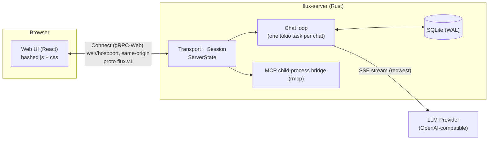
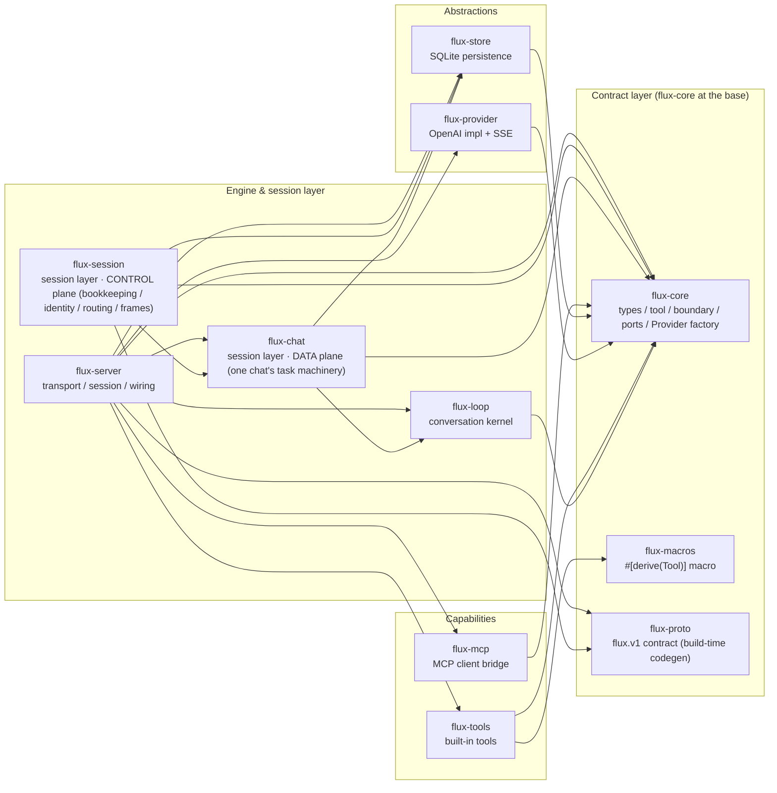
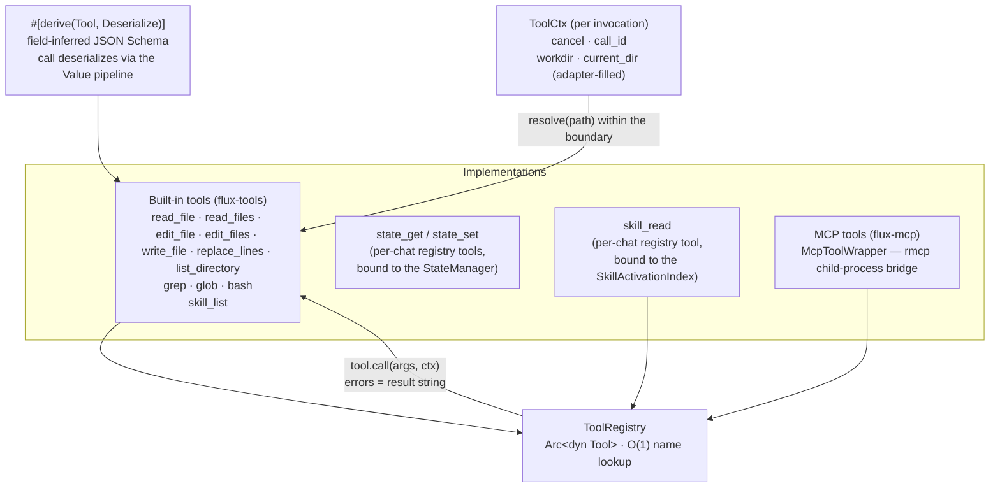
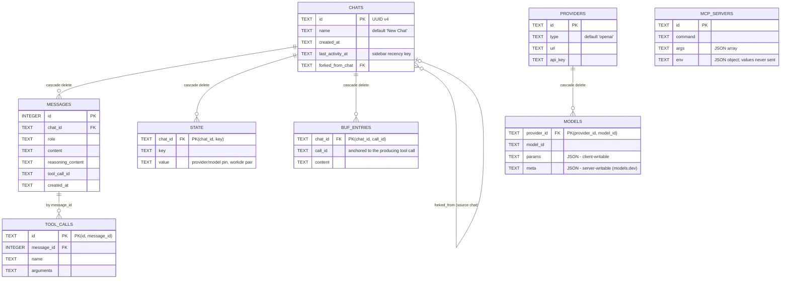
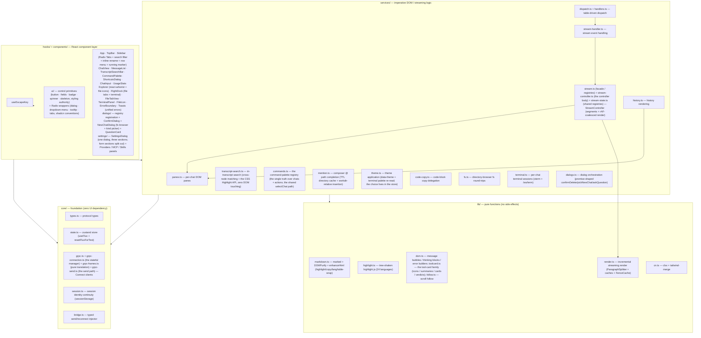

# Flux Architecture

> 中文版: [architecture.md](architecture.md) · Accepted tradeoffs: [decisions-en.md](decisions-en.md)
>
> This document describes the actual architecture of Flux. All diagrams use Mermaid (rendered natively by GitHub and the VSCode Markdown preview).

## Table of Contents

1. [System Overview](#1-system-overview)
2. [Repository Layout](#2-repository-layout)
3. [Backend](#3-backend)
 - 3.1 [Core Concepts: ServerState / Chat / Session](#31-core-concepts-serverstate--chat--session)
 - 3.2 [Lifecycle](#32-lifecycle)
 - 3.3 [Conversation Loop](#33-conversation-loop)
 - 3.4 [Tool System](#34-tool-system)
 - 3.5 [Tool Context & Boundary (no approvals)](#35-tool-context--boundary-no-approvals)
 - 3.6 [Sandbox Semantics: workdir / current_dir](#36-sandbox-semantics-workdir--current_dir)
 - 3.7 [Persistence](#37-persistence)
 - 3.8 [Connect Protocol & Backpressure](#38-connect-protocol--backpressure)
 - 3.9 [Configuration](#39-configuration)
 - 3.11 [Web UI static serving](#311-web-ui-static-serving-webrs)
 - 3.12 [Terminal side channel](#312-terminal-side-channel-wsterm)
4. [Frontend](#4-frontend)
 - 4.1 [Layered Structure](#41-layered-structure)
 - 4.2 [State Management](#42-state-management)
 - 4.3 [Streaming Render Engine](#43-streaming-render-engine)
 - 4.4 [Build & Test](#44-build--test)
5. [Key Design Decisions](#5-key-design-decisions)
6. [Development & Verification](#6-development--verification)

---

## 1. System Overview

Flux is a general-purpose coding-agent framework: a local Rust server runs the LLM conversation loop, tool execution, and persistence; a browser Web UI (React + Tailwind, served statically by the server) provides the chat UI and streaming rendering. The two communicate over the Connect protocol (gRPC-Web; `proto/flux/v1` is the single contract source).



Key points:

- **Model-agnostic**: the conversation engine (flux-chat) depends only on flux-core's `Provider` factory (`begin` opens a `Connection`); the OpenAI-compatible implementation is the current one.
- **One Subscribe stream multiplexes many chats**: several chats can be active on a single stream; unary RPCs pair natively over HTTP.
- **Binds `127.0.0.1` by default**; no application-level authentication — remote exposure goes through a reverse proxy (TLS + its own auth).

## 2. Repository Layout

The Cargo workspace contains 11 crates with strictly bottom-up dependencies; the frontend is independent of the workspace.



| Crate | Responsibility |
|---|---|
| `flux-core` | Kernel contract layer: pure types (`Message` / `Role` / `ToolCall` / `CoreError` / `ErrorCode` / `ChatStateKind`), `WireEvent` (kernel output vocabulary), the kernel I/O vocabulary (`loop_io.rs`: `LoopInput` / `LoopFact` + `RoundOutcome` / `StreamEvent` / `StreamHandle` / `Connection`), the `Tool` trait + `ToolRegistry`, boundary resolution (`boundary::resolve_path`, the implementation behind `ToolCtx::resolve`), the kernel ports (`ToolPort` tool execution + `OutputPort` adapter-side event sink), and the `Provider` session factory (zero I/O; deps: serde, serde_json, strum, thiserror, async-trait, tracing, futures, tokio-util). The proto contract (`flux.v1`) lives in `flux-proto` (build-time generated); flux-session's router is the ONE mapping point from WireEvents to stream elements  |
| `flux-macros` | `#[derive(Tool)]` proc macro: field-inferred JSON Schema + `call` deserialization; `#[derive(ToolItem)]` generates `item_schema()` for nested array-of-object parameters |
| `flux-provider` | OpenAI-compatible implementation + SSE parsing, implementing flux-core's `Provider` session factory (each instance is model-pinned; `begin` opens a `Connection`) |
| `flux-tools` | Built-in tools: file / shell / search / Agent Skills (`skill_list` + the skill-format authority: discovery / reads / the catalog section / activation formatting) + the shared subprocess runner |
| `flux-mcp` | MCP client bridge: spawns external MCP servers (the launch list lives in the DB, UI-managed, persist-first + live-apply) and exposes their tools; receives server notifications — `tools/list_changed` over BOTH paths (the notification hook + a subscriptions/listen stream, covering spec ≤ 2025-06-18 and 2026-07-28), `notifications/message` logs forwarded to the UI |
| `flux-store` | SQLite persistence (sqlx, WAL: chats / messages / state / providers / mcp_servers) |
| `flux-loop` | Conversation kernel: pure state machine (`machine.rs`) + a pure pump driver (`runtime.rs`: consume input, step, forward facts in order) — zero I/O, zero trait objects |
| `flux-chat` | Session layer · DATA plane: one chat's task machinery (`chat` entity / `domain` state + state tools / `handle` control handle / `spawn` assembly / `round` round consumer — fact fold + flight supervision; `Rebuild` → in-place rebuild at the machine gate, the task never exits) / `tool_exec` flight-supervision library (no task of its own) / `buf` overflow buffer (store-backed) / `skills` chat-owned `skill_read` (activation dedup) + catalog composition / `question` ask-the-user tool / `reserved` reserved-tool-name check). Depends on flux-core ports (`OutputPort`) and flux-tools' skill-format authority — no reverse dependency on the control plane |
| `flux-session` | Session layer · CONTROL plane: bookkeeping that spans chats and sessions — `manager` (`ServerState`: global config + chat cache + identity registry) / `ops` (lease · subscribe · broadcast) / `router` (WireEvent → proto stream elements) / `lifecycle` (lazy spawn & task replacement) / `identity` (session id & typed sink) |
| `flux-server` | TCP transport (the Connect surface `/flux.v1.*` + the terminal side channel `/ws/term`), `grpc/*` (the serialization-thin chat/event/management/fs services), wiring, CLI (no config file: flags + `FLUX_*` env fallbacks + `--generate-completions` shell completions), `ProviderRegistry` (provider management: selection / instance building / model probes / endpoint edits (UpdateProvider — persist-first slot swap, then re-resolving the pinned chats' instances; live engines hot-apply at the gate), instances handed to the chat layer), `McpManager` (MCP launch-list management: persist-first + live apply) |
| `clients/web` | Web UI (the single frontend,): React 19 + Radix UI + Tailwind v4 + zustand, built with Vite |

## 3. Backend

### 3.1 Core Concepts: ServerState / Chat / Session

Three core concepts, three files:

| Concept | File | Role |
|---|---|---|
| **ServerState** | `crates/flux-session/src/manager.rs` | i.e. the ChatManager: global config + `RwLock<HashMap<ChatId, CachedChat>>` + an `identities` registry (token → `SessionRef`, live and detached in one table) + a router channel per chat. `CachedChat` carries `lease` (the holder's identity handle), `viewers` (subscription set, keyed by the identity's internal serial), `task` (lazily spawned `ChatTask`), `router`; chat IDs are UUID v4 |
| **Chat** | `crates/flux-chat/src/chat.rs` | Internal conversation — implements the kernel's `ToolPort` (existence → ctx boundary fill → execute → output bounding + per-chat tool registry + state; persistence is a fold over the fact trace, not a port). **Model-agnostic**; events are emitted through `OutputPort` (production impl: the router sink) to the chat's viewers |
| **EventPlane** | `crates/flux-server/src/grpc/events.rs` | The session-scoped `Subscribe` stream IS the identity lifecycle anchor: open = attach (a request token adopts within the grace window, absence mints), the first `ready` frame carries the authoritative token + leases (the resume handshake collapsed into the stream open), stream close = detach (the grace/reaper machinery is unchanged). The stream carries its own sink (two bounded queues + a biased pump, control first) and injects 30s keepalives (the client's frame deadline detects half-open) |

**Key design**: task ownership belongs to the ChatManager (sessions are irrelevant to it); **identity = the `Session` object** (`identity.rs`: resume token + internal routing serial + current connection sink + detached marker, all cohesive in one `Arc` handle) — lease/subscription/routing structures hold the `SessionRef` directly; authorization is handle-equality, and the token string appears only in the ready frame and the token lookup — the chat domain carries zero session vocabulary. Operating rights = at most one `lease` per chat (send/cancel/answer/delete/rename require the lease — anyone else is refused with `ErrorEvent{chat_busy}` (a refused RPC also maps to a failed_precondition status); the busy element carries no holder identifier — the resume token is a bearer credential and never enters another client's stream); viewing rights = the `viewers` set (`chat_claim` implies subscription; `chat_open` is the degraded viewer path, concurrent). A Session disconnect = **detach**: the connection sink is cleared (teardown passes its sink pointer to guard against stale takeovers), viewer registrations are dropped, the lease survives a 30s grace window awaiting the stream's re-open (attach swaps the sink and clears the marker), and the reaper releases expired leases and removes the identity from the registry (tasks keep running).

Dependency injection and test seams (trait layers designed for testability):

- `OutputPort`: the task's event outlet (`WireEvent`); production impl is `ChannelOutput` (forwards to the chat's router), tests use a fake port;
- `SessionSink`: the router's delivery port (typed proto stream elements); production impl is the event stream's `StreamSink` (two bounded queues + a pump), tests use `RecordingSink`;
- `Provider` factory (flux-core) / `Connection`: `Provider::begin` creates a stateful session; `Connection::open(pending, sink)` pushes parsed stream events into the loop's input channel and returns the `StreamHandle` cancellation capability;
- `ChatInfoOwned` / `ChatInfoGuard`: zero-copy cache snapshots — take the snapshot, drop the read guard, then serialize and send; **the read lock is never held across I/O or network sends**.

### 3.2 Lifecycle

```mermaid
sequenceDiagram
 participant C as "Client (Browser)"
 participant S as "Subscribe stream (EventPlane)"
 participant SS as ServerState
 participant CH as "Chat (task)"
 participant DB as SQLite

 C->>S: Subscribe {session_id?} (stream open = attach: adopt within grace
 or mint; every later unary carries x-flux-session metadata → the SAME SessionRef)
 S-->>C: ready {session_id, leases} (authoritative identity + leases — the resume handshake collapsed into the open)
 C->>S: CreateChat {name, workdir, provider, model} (unary; inline errors)
 S->>SS: create_chat(...)
 SS->>DB: insert_chat
 S-->>C: chats broadcast + CreateChatResponse{chat} (lease + subscription to the creator; the task is lazy)
 C->>S: ClaimChat {chat_id} (operator single call: snapshots ride the stream + subscribe + lease;
 a foreign lease STEALS — the old holder receives ErrorEvent{chat_busy} on its stream)
 S->>SS: claim_chat(session, chat_id) + DB load_messages
 S-->>C: chat_history / chat_state (stream elements, peeked seq)
 C->>S: SendMessage {chat_id, message} (needs lease; auto-claims when empty)
 S->>SS: ensure_task + send_message
 SS->>CH: spawn(init, llm, tools, store, router)
 CH-->>C: text_delta / tool_* / usage / stream_end (router → proto elements → viewers)
 C->>S: OpenChat {chat_id} (viewer demotion: chat_busy recovery / stream_gap resubscribe)
 C->>S: CancelRound {chat_id}
 C->>S: CloseChat {chat_id} (full exit = unsubscribe + release lease)
 C->>S: stream close (page refresh / connection death)
 S->>SS: detach : viewer registrations dropped, lease kept for the
 30s grace window awaiting the stream's re-open; the reaper releases +
 broadcasts on expiry (the task keeps running, idling after its round)
```

- Cached active chats are handled by client-side chat-list state — never spawned twice;
- Chats are lazily spawned on the first message (`ensure_task`) and keep running across rounds. Tasks live until the chat is deleted;
- On delete: the Session terminates its own task first, then `delete_chat` runs (FK cascades clean up messages/state).

**Task termination semantics** (lifecycle.rs): no crash supervision — the codebase promises no crashes (all fallible paths are Result-based; no self-introduced panics), and no mechanism exists to maintain panics. The consumer task exits when:

1. **The fact channel closes** — the loop died (no senders left on the input FIFO);
2. **The control channel closes** — the handle dropped (chat deletion or task replacement).

Both exits set the done flag via a drop guard; a stale handle is replaced lazily by the next `ensure_task` (the rebirth loads the full persisted history). An **engine rebuild is NOT an exit**: the consumer rebuilds in place at the machine gate (see below) — the task ends only when the loop dies or the control channel closes; every other exit keeps the no-crash-supervision philosophy (lazy replacement). Error paths all go through Result: provider/tool errors emit `error{...}` frames, unrelated to the termination machinery; `stream_crashed` remains the default wire code for a StreamError without a specific mapping.

### 3.3 Conversation Loop

Each chat runs **one pure two-channel loop**: the kernel (`flux_loop::Loop`) consumes `LoopInput` from an input channel, steps the pure state machine, and pushes `LoopFact` (the semantic fact trace) onto a bounded output channel — **zero I/O, zero trait objects**; every collaborator is a channel peer wired by the adapter:

```mermaid
sequenceDiagram
 participant U as User
 participant RT as "Loop (pure pump)"
 participant M as "Machine (pure reducer)"
 participant C as "Round consumer (fold)"
 participant FL as "Flights (supervised tool flights)"
 participant P as "Connection (push stream)"
 participant R as "Router → viewers"

 U->>RT: send_user / cancel (one input FIFO)
 RT->>M: step(UserMessage) → TranscriptCommitted + ModelInputRequested
 RT->>C: facts (bounded trace, the backpressure surface)
 C->>C: persist (awaited inline — persist-before-announce)
 C->>P: connection.open(pending, sink)
 P-->>RT: StreamChunk + StreamHandle (via the input FIFO)
 RT-->>R: Wire(TextDelta / ReasoningDelta / Usage) → broadcast to viewers
 alt no tool calls
  RT->>C: TranscriptCommitted + Wire(StreamEnd) (persisted before announced) + RoundEnded(Completed)
  C-->>R: stream_end
 else tool calls present
  RT->>C: ToolDispatched
  C-->>R: tool_start
  C->>FL: dispatch (supervised flight, one at a time)
  Note over FL: Two-tier interrupt: cooperative token → 5s grace → drop future (process group killed, partial output kept)
  FL-->>C: FlightOutput (exactly one per task; panics captured structurally)
  C->>RT: ToolFinished
  RT->>C: Wire(ToolResult) → tool_result
 end
```

- **Pure pump + pure reducer**: the loop is machine + two channels (input FIFO every peer writes, bounded fact trace out); `Machine::step` is total — every (state, input) pair is defined; policy (when to interrupt, when not to) lives in the reducer, mechanism (tokens, drops, I/O) in the channel peers;
- **The peers** (wired by the adapter, all speaking flux-core's `LoopInput`/`LoopFact` vocabulary): the **provider connection** (`open(pending, sink) → StreamHandle` push-model; stall watchdog + EOF-truncation detection inside; drop = cancel; the connection lives until the next machine gate — a truth-source change makes the consumer RE-BEGIN it in place, the old one dropping with the swap) and the **tool flights** (the `tool_exec` supervision library driven by the consumer's select loop — no task, no command channel; the completion arm pushes exactly one `ToolFinished` back into the loop's FIFO). The **round consumer** folds the fact trace: persistence (awaited inline — persist-before-announce survives; a single-message USER commit additionally announces `message_persisted` with the assigned row id, so the sender's client can name its own live bubble), routing, provider triggering, tool dispatch + flight supervision (`InterruptTools` cancels the in-flight token inside the same fold loop), and the engine rebuild (arm the machine gate → rebuild IN PLACE at the fired gate — re-assemble the registry from the current global truth, re-begin the connection over the full persisted history). The provider connection's SSE tool-call accumulator NEVER self-sizes from the wire's `index` field — indices at/above `MAX_TOOL_CALL_INDEX` (128; the request runs n=1 and even multi-call responses are single digits) are dropped with their fragments behind a warn-ONCE latch (a flood of dropped fragments must not flood the log); the 16 MiB byte cap bounds bytes, not this per-index amplification (a few-byte `{"index": 10⁹}` fragment would otherwise allocate billions of entries in one step);
- **Tool flights**: each tool call spawns as a supervised task (the consumer's third select arm: JoinSet, driven from the `tool_exec` library — no task, no command channel); completion is collected by the consumer and returns to the machine as a `ToolFinished` input (exactly one per dispatch — a construction property); `catch_unwind` turns a tool panic into a transcript error result;
- **Two-tier interrupt** (`InterruptTools` fact → the consumer cancels the in-flight token inside its fold loop): tier 1 cancels the in-flight tool's cooperative token (`ToolCtx`) — a tool that stops in time contributes its partial output (subprocess kills the process group then drains the pipes, partial output reaches the transcript; MCP stops waiting); tier 2 force-drops the future of a tool that ignored the token after a grace period (`INTERRUPT_GRACE`, 5s) — abort-equivalent, Drop-based cleanup still runs. Interrupted results are supervisor-marked (`INTERRUPTED_MARK`) — **tools never self-report cancellation**;
- **Sequential single-flight tools**: multiple tool calls within one round dispatch strictly one at a time (observable deterministic semantics);
- **Cancel = a plain queue event**: `Input::Cancel` shares one FIFO channel with messages. While streaming → `Cancelled` wire event wrap-up; while a tool flight runs → interrupt it + the `cancelled` absorption flag (remaining batch voided), wrap up once the interrupted result dual-writes; in Idle a silent no-op; the queue dies with the cancel (stop means stop — the R1 interrupt-send guarantees the cancel-first order: the server writes both inputs back-to-back onto one FIFO, so a turn sent after the cancel still runs);
- **The machine turn queue (mid-round user turns)**: a `UserMessage` arriving mid-round (streaming / tool flight) is QUEUED, not dropped (FIFO) — it starts in the SAME step that wraps the current round, with the boundary reported step-locally (`RoundState(Idle)` — the loop's transition check cannot emit it because the step re-enters Streaming; a following `RoundState(Streaming)` restores the snapshot truth). The kernel serializes user turns itself: the R1 interrupt-send fuses cancel+message into a single RPC, so the ordering dependency is architecturally gone. Invariant: the machine never rests Idle with a non-empty queue — an armed gate defers to queued rounds (they run pre-gate, inside the pre-rebuild context);
- **Engine rebuild (the generic restart primitive — the machine gate)**: everything the kernel knows collapses into ONE gate primitive — `Hold` (at Idle the gate fires AND drains in the same step, emitting `GateReleased` directly: nothing is running and everything sent before the decision precedes the Hold in the FIFO; mid-round it arms to engage at wrap-up) and `GateReleased` (the gate fired — queued turns ran pre-gate, inside the pre-rebuild context). Selection and semantics live entirely in the round consumer (see the consumer bullet in 3.3): the mutators (the session layer's SwitchProvider / MCP management / the provider endpoint edit — UpdateProvider swaps the url / api key behind the id and re-resolves the pinned chats' instances) **write the truth sources first** (the pin persists at request time, the global registry mutates) and announce the wire notice, then send `Rebuild` (a provider swap and an endpoint edit carry the fresh instance); the consumer rebuilds IN PLACE at the fired gate — re-assembling the registry and connection over the full persisted history via the SAME assembly path spawn/hydration use, then injecting a pending follow-up. A live round is never interrupted; the change and its effect decouple; the engine never dies for a rebuild, and sends arriving during the rebuild ride the kernel queue (they run pre-gate on the old connection — FIFO-self-consistent). **The gate fire DISCARDS pending** (both fire points: a Hold arriving at Idle, and the armed gate at wrap-up) — the interrupt residue (the voided queued tools' results + the in-flight tool's partial output) is carried by the REBUILT prefix: the gate only fires at Idle/wrap-up where the transcript was just committed, so the full persisted history already contains every pending message; re-sending it would duplicate tool messages (wasted tokens, broken prompt-prefix caching, strict endpoints 400). Queued turns that started BEFORE the gate still deliver the residue — they run on the pre-rebuild connection, whose prefix genuinely lacks it;
- **`stream_end` means**: the assistant message for this round is fully streamed and persisted; the frontend finalizes rendering on receipt; an optional `finish_reason` carries the provider's end reason (`length`/`content_filter` = truncated, shown as a neutral notice). The reason is announced only at round end: a tool round's first `End` reason is dropped by design, and the final `StreamEnd` carries the follow-up stream's own reason (`"stop"` after a normal wrap-up).

### 3.4 Tool System



- **Tool context + pure execution (no approvals)**: the sandbox boundary (`workdir` / `current_dir`) reaches tools as **invocation context** via `ToolCtx` — the kernel builds the ctx with the cancel token and call id only (it is boundary-agnostic); `Chat` (the ToolPort adapter) fills the boundary fields from authoritative state at dispatch, then calls `tool.call`. Inside the tool, path arguments resolve via `ctx.resolve(path)` (absolute inputs must land inside the boundary; relative inputs join it; nonexistent paths walk to the deepest existing ancestor + tail). Resolve/execution failures are the tool's result string (`Error: {reason}`) — visible to the model, never a round-level block. Tools are pure executors: they never touch the state store; no tool schema carries a boundary parameter — extra LLM keys take no part in parsing, so forged path arguments are structurally inert.
- **Cooperative cancellation contract**: `Tool::call(arguments, ctx: ToolCtx)` carries the kernel-owned `CancellationToken` — on user interrupt the tool should stop promptly and return its partial output (bash passes it to the shared subprocess runner: kill the process group + drain to preserve partial output; MCP stops waiting on the request). A tool that ignores the token is force-terminated by the kernel after a grace period. Tool results never self-report cancellation — the kernel marks interrupts uniformly. The derive macro threads the ctx into `execute(ctx)`.
- **Value argument pipeline**: args are `HashMap<String, Value>` end to end — one-step JSON parse; numbers and nested objects pass through untouched (MCP nested parameters arrive intact); tool structs keep strongly typed fields (`read_file`'s `offset`/`limit` remain `usize`, schema stays `integer`) — zero change to the LLM contract. The macro body deserializes via `Value::Object(args)`.
- **Single source for schema/parsing**: built-in tools are field structs; the macro infers JSON Schema from the fields (including doc comments) and `call` auto-deserializes arguments (failure → `CoreError::InvalidArguments`); `#[tool(skip)]` / `#[tool(required)]` / `Vec<T>` inference kept; `#[serde(default)]` fields stay out of `required`. When a `Vec<Item>` element type is non-primitive, `items` delegates to `<Item>::item_schema()` (generated by `#[derive(ToolItem)]`; a missing derive fails compilation) — the object-array parameters of `read_files`/`edit_files` ride this; item optionality is expressed with `Option<T>` only (`#[serde(default)]` unsupported on item fields). Multi-item fs tool semantics: several operations per call (cap 16 items); `read_files` continues past a failed item; `edit_files` applies same-file edits in listed order (later edits may match text earlier edits introduced) and is **atomic per file** — one failed edit leaves that file unwritten while other files still apply; an all-files-failed call surfaces one error.
- **glob bases on `current_dir`**: glob's search root = the ctx's `current_dir` (matching bash's shell-cwd semantics — after the model moves it with `state_set current_dir`, glob follows); bash runs at `ctx.current_dir` (empty → `InvalidArguments`, fail-closed).
- **Agent Skills (a catalog snapshot in the prompt + progressive disclosure BY TOOLS)**: a skill = a self-contained capability package (a directory with a `SKILL.md`: frontmatter `name`/`description`, body = instructions). Three consumption surfaces share one discovery/format authority (`flux_tools::skills`): (1) the **Tier-1 catalog** — the two begin points (`spawn` / `apply_rebuild`) append a catalog section (name + source + description; per-entry truncation at 1024 chars, total budget 8000 chars, an explicit "…N more" tail note; with no skills the section never appears) AFTER the preamble (prefix caches keep the preamble byte-stable); the catalog is a **snapshot** of the begin point, and the section text says so and points at `skill_list`; (2) `skill_list` scans fresh on every call (no restart semantics) — the live rescan complement to the snapshot and the self-correction path for mid-session installs, budget truncation, and hallucinated names (global skills live OUTSIDE the boundary; this is the model's only way to enumerate them); (3) `skill_read` is **chat-owned** (`flux_chat::skills`, registered like `buf_read`, in the reserved set) — **activation dedup derives from the transcript**: both assembly points derive an activation index from the history (key = name + lexically normalized rel; overflow discriminator = result char count > INLINE_BUDGET, overflowed content read back through buf_entries); a hit (identical normalized-content hash) returns a short note instead of re-injecting (with the buf_read ref when it overflowed), a miss returns the full content and records itself — **no new storage**: fork / rebuild / restart are correct by re-derivation (the store is the only truth, read-side derivation, same as validate_history). Content identity has ONE source = `skill_content`: the manifest counts as its frontmatter-stripped body (metadata was consumed at discovery — editing frontmatter alone still hits), every other file as raw; an activation returns `<skill_content name>` wrapping the body plus a bundled-file listing (shallow symlink-safe walk, capped at 20, paths only — never eagerly loaded; no absolute skill root is surfaced — the name-keyed contract doesn't need it). Locations: project `<workdir>/.flux/skills/` (inside the boundary) + global `~/.flux/skills/` (user-installed trusted content, the same trust tier as MCP servers launched from the DB); on a name collision the project entry wins. `skill_read` is **name-keyed** — the model never passes a path; the requested file resolves relative to the skill root under a strict containment check (canonicalize + prefix, symlink-safe), so a read structurally cannot leave the skill directory;
- **Output overflow buffer (centralized, anchored, persisted)**: every tool result passes `Chat::bounded_output` — outputs over 8000 chars are written through to the per-chat `buf_entries` table (anchored to the producing tool call's id, `ToolCtx::call_id`) and the tool returns a head + a reference that IS the call id; the model reads the rest with `buf_read {ref, offset, limit}` (char-based paging, pages ≤ 6000 chars, no recursion; read-through to the store). **Never overwritten, no generation wipe**: the reference is self-describing and stable (the transcript carries the same id), so entries survive engine rebuilds AND process restarts with no shell handoff (the in-memory buffer is gone; the store is the only truth); the lifetime equals the chat's lifetime (a transcript only grows — there is no archive boundary, no GC); a FORK copies the entries of the calls its copied transcript carries, keeping `buf_read` references resolvable in the fork; chat deletion cascades. Entries capped at 1M chars. Per-tool caps merged into the central layer: bash 8KB / read_file line-length and total truncation removed; grep keeps its match-window shaping + 500 matches; glob 500. grep paths relative to the search root; read_file footer `end` = last shown line (inclusive), fires at exactly `limit+1` lines remaining;
- **MCP**: the free function `connect_with_peer` connects external MCP servers (`McpServerConfig` enum: `Stdio` child processes / `Http` Streamable HTTP endpoints — rmcp's `StreamableHttpClientTransport`, custom headers carry auth, `allow_stateless` accepts session-less servers, `reinit_on_expired_session` re-handshakes in-transport on a 404 session expiry; proxies come from the process environment `http_proxy`/`https_proxy`/`all_proxy` — loopback targets are EXEMPT, a `127.0.0.1`/`localhost` endpoint is a local server, the stdio tier's sibling, and must never ride a proxy; 30s init timeout), wraps their tool lists as `McpToolWrapper` (60s per-call timeout); `McpSession` is an RAII keep-alive guard shared by both transports (`QuitReason::Closed` under HTTP is a dropped connection, reconnected by the same supervisor's capped backoff — the transport's in-transport SSE retry / session recovery is the INNER self-healing ring, the supervisor the outer one). The supervisor guards itself with an **entry generation** — every connect (restore / add / respawn) mints a monotonic generation paired with BOTH the entry and its supervisor task, and every entry-mutating step re-checks the pair under the lock: a backoff wake finding the entry removed OR replaced → the old supervisor exits; a respawn adoption DROPS the superseded connect's session (killing the duplicate child) instead of clobbering it; the `tools/list_changed` notice carries the generation, so a stale signal cannot re-register over the current set (adoption also checks the entry BEFORE registering, so a vanished entry can no longer leak its registrations). The remove→re-add race (an id deleted and re-added inside the backoff sleep) therefore structurally cannot produce duplicate sessions, a clobbered empty tool set, or a cancel pointed at the wrong session. The launch list lives in the server database (UI-managed, persist-first + live apply: the `McpManager` holds the global registry reference — a successful connect registers, a removal unregisters exactly the owner's names, then engine rebuilds fan out; a connect failure rides the ack inline and the row stays, a startup failure is skipped with a warning — the UI stays reachable to fix it).

### 3.5 Tool Context & Boundary (no approvals)

Flux's design stance: **tools execute without user confirmation** — no prompts, no
remembered allow-lists, no fail-closed default. The old approval layer's duties are
carried by decision-free mechanism: path correctness = in-boundary resolution (the tool
invocation context,), write normalization = the state write point, and "waiting for
user input" = the `question` tool . See the "Trust model" section in AGENTS.md.

`ToolCtx` (flux-core, one per invocation):

| Field/method | Source | Semantics |
|---|---|---|
| `cancel: CancellationToken` | kernel-built | User-interrupt token (cooperative cancel + grace-period force kill) |
| `call_id: String` | kernel-built | Kernel-assigned tool-call id (`question` reply pairing) |
| `workdir: PathBuf` | filled by the adapter (Chat) | Sandbox boundary — carried at chat creation, canonical, read-only state |
| `current_dir: PathBuf` | filled by the adapter (Chat) | Transient shell cwd — canonical, always inside the boundary, consumed by bash/glob |
| `resolve(input)` | called by tools | Resolve a path within the boundary; escapes / dangling symlinks / `..` tails → tool error |

**The `question` tool (asking the user)**: the ecological successor of the approval
prompt — round-blocking, lease-holder-answered, priority control channel with
parking/re-delivery on claim — but with the content direction reversed: the question text
and options are entirely agent-produced, and the user's answer becomes the tool result.
The tool waits via a per-chat `QuestionBoard` (`HashMap<id, oneshot::Sender>`) and
`select!`s the cooperative cancel token (a user cancel resolves the flight uniformly,
kernel-marked, and the tool deregisters its own board entry — the map does not leak,
and a stale answer is dropped as unknown). Esc/close = a neutral `DISMISSED` answer text; the round continues. The
`id` pairs with the tool call via `ToolCtx.call_id` (filled by the kernel at dispatch).

### 3.6 Sandbox Semantics: workdir / current_dir

- **`workdir` = the sandbox boundary (read-only state)**: carried at chat creation, canonicalized, and persisted into the state table (`list_chats` joins it to deliver `ChatInfo.workdir`); at load the `StateManager` extracts `workdir` into a **fixed field** — it never re-enters the mutable map, and `set("workdir", …)` is refused at the single write point. `state_get` surfaces it read-only through the fixed field (model introspection); cross-project work = a new chat.
- **`current_dir` = transient shell cwd (writable state)**: seeded with workdir; the model moves it via `state_set`, and it steers bash (spawn cwd) and glob (search root). **Canonicalization at the write point**: the `state_set` tool resolves via `ctx.resolve` (boundary containment) then canonicalizes (must exist — it becomes a spawn cwd), so the stored value and every later use agree on the resolved path (a raw symlinked path on macOS /Users would make file tools' lexical comparisons hard-deny every read — canonical-at-write removes the discrepancy).
- **Path-resolution security semantics** (`boundary::resolve_path`, single flux-core implementation shared by flux-tools and flux-chat): existing paths canonicalize directly; nonexistent paths walk to the deepest existing ancestor + tail append — the walk explicitly rejects `..`/`.` tail components (`starts_with` does not normalize `..`; never rely on the incidental `None` that `file_name` returns for a `..`-terminated path) and rejects dangling symlinks (`symlink_metadata` distinguishes "exists" from "missing component" — otherwise a later write would follow the link and create the file outside the boundary), covering `..` escapes on **nonexistent paths** (e.g. `a/../../../../etc/new`) and **symlink-ancestor escapes** (e.g. `escape_link/newfile.txt`).
- **The `state_set` key space is open (by design, do not "fix")**: the schema `enum` lists only the known keys as LLM guidance; the write path does not reject unknown keys — `state_set` doubles as the AI's generic cross-round KV persistence channel (any key readable/writable; `state_get` on an unknown key returns the empty string, symmetric with the open write side). Boundary semantics live solely in the two authoritative keys: `workdir` (read-only) and `current_dir` (canonicalized at write).
- **Fail-closed default**: with an empty ctx boundary (test scenarios only in practice — production `create_chat` aborts when the workdir cannot be persisted), `resolve` and the empty-boundary checks in bash/glob error out immediately — never a silent fallback to the server process's cwd.
### 3.7 Persistence

`flux-store`: sqlx `SqlitePool` (WAL, 4 connections). Per-connection PRAGMAs: `journal_mode=WAL`, `synchronous=NORMAL`, `foreign_keys=ON`, `busy_timeout=5000`, `cache_size=-65536`, `mmap_size=268435456`, `temp_store=MEMORY`, `wal_autocheckpoint=2000`. Opening ensures `auto_vacuum=INCREMENTAL` once (a legacy NONE-mode database's rebuild VACUUM runs at open, before the listener binds); `PRAGMA optimize` at startup; conditional `incremental_vacuum` hourly (freelist ≥ 1000 pages, a short normal write transaction — no whole-db VACUUM lock window while serving).

One consolidated migration (`crates/flux-store/migrations/001_consolidated_schema.sql`): the final shape is created in one pass. Unreleased — no legacy-DB burden; schema changes edit this file in place (the established "upgrade = rebuild" decision), while the sqlx migration mechanism stays for a future released version:



Key points:

- `append_messages` is a transactional batch write (messages + tool_calls committed together);
- `messages` has a `(chat_id, id)` index;
- State is stored as pre-serialized JSON strings, loaded via tolerant deserialization;
- Usage is not persisted: a `usage` event rides every round and the frontend accumulates compact ↑/↓/R/W totals.

### 3.8 Connect Protocol & Backpressure

**Protocol surface**: `proto/flux/v1` (buf-managed; the STANDARD lint is the naming authority) is the ONE contract source — the Rust binding generates at cargo build (`flux-proto`, tonic/prost, OUT_DIR), the TS binding derives via the web package's prebuild/pretest hooks (`buf generate`, never committed); CI re-derives + `buf breaking` + freshness checks. Transport = **gRPC-Web over HTTP/1.1** (tonic-web mounted on the same axum router; the browser talks `@connectrpc/connect-web`), single-port coexistence with the static site.

**Identity & lifecycle**: the session-scoped `Subscribe` stream anchors the identity — open = attach (`SubscribeRequest.session_id` adopts within the grace window, absence mints), the first `ready` frame carries the authoritative token + leases (the resume handshake collapsed into the stream open), stream close = detach (the grace window and the reaper are mechanically unchanged). The server injects keepalives every 30s; the client's frame deadline (3×) detects a half-open connection. Unary calls carry the token in `x-flux-session` metadata → `session_leases` resolves the SAME `SessionRef` object; lease-gate refusals map to standard statuses (busy → failed_precondition, unknown → not_found, no/unknown token → unauthenticated trailers-only).

**Error model (D4')**: application-level failures ride the response's inline `error` field (management-plane validation, create validation, fs browsing — request-scoped UI data); transport/infrastructure failures are gRPC statuses; the stream's `ErrorEvent` elements (code enum) carry the app-level error channel (round errors, in-band demotion, slow-viewer gap notices).

**Services** (full semantics in AGENTS.md's protocol table; the structure here):

| Service | RPCs |
|---|---|
| ChatService | CreateChat · ListChats · OpenChat · ClaimChat · CloseChat · DeleteChat · RenameChat · SendMessage · CancelRound · ForkChat · SwitchProvider · AnswerQuestion |
| EventService | Subscribe (the stream: ready → events + keepalives → close = detach) |
| FileSystemService | FsList · FsRead |
| ProviderService | ListProviders · GetModels · AddProvider · RemoveProvider · UpdateProvider |
| ModelService | ListModels · SaveModel · RemoveModel · SyncModels |
| McpService | ListServers · AddServer · RemoveServer |
| SkillService | ListSkills · AddSkill · RemoveSkill |

**Stream elements** (`SubscribeResponse {chat_seq, chat_id, kind}` — 22 variants): `ready{session_id, leases}` (first frame) · `keepalive` · `text_delta` / `reasoning_delta` / `stream_end{finish_reason?}` / `stream_cancelled` · `tool_start` / `tool_result` (preceded by `tool_call_preview` — identity + argument-stream notice while the model is still forming the call; the client renders a pending card that `tool_start` upgrades in place; a never-upgraded preview voids at round end, never persisted) · `usage` · `question_required` (the control lane) · `chat_history` / `chat_state` (the claim/open snapshots ride the stream — single-point delivery with the events they reconcile against) · `error` · `provider_switched` · `message_persisted{id, content}` (a user message persisted, announced at turn acceptance — the sender's client attaches the fork affordance to its own live bubble by content match; the id is the fork point carried by ForkChatRequest) · global broadcasts `chats` / `chat_created` / `providers` / `models` / `mcp_servers` / `skills`.

**R2 sequence reconciliation**: every chat carries a monotonic `seq`; the router's fanout consumes (fetch_add's old value — all viewers see the same number for the same element), the claim/open snapshots peek without consuming. The client records the snapshot's seq and drops gated content elements STRICTLY BELOW it (the first event after a snapshot reuses its value — the equal one is the first live element after the snapshot); errors/questions/snapshots/global broadcasts are exempt (type-scoped).

**Backpressure and dropped frames** (`StreamSink` + the per-chat router, `grpc/events.rs` / `router.rs`):

- Chat output flows through a per-chat routing channel (bounded 1024; full = the task stalls) → the router builds the proto element ONCE (the R2 seq lands in the `chat_seq` field — the JSON envelope and the `stamp_seq` injection are gone) and fans it out to each viewer's sink (**single drop surface**: the stream's content queue, 1024);
- A failed content send (sink `send == false`; slow client, queue full) marks the viewer as dropping: incremental elements are skipped silently until a boundary event or a resubscribe, and an `ErrorEvent{stream_gap}` notice goes out via the **control channel** — a small priority queue (16) the pump's biased select drains first, so the notice still arrives under saturation; a slow viewer never stalls others;
- Boundary events travel the content path in order and clear the drop mark; under saturation the boundary element itself may drop — the client heals by reloading (CloseChat + ClaimChat re-fetches history and rebuilds the subscription) after the gap notice;
- Question prompts also use the control channel straight to the lease holder (with no holder the question is parked and re-delivered on the next claim; **a round boundary clears the parked copy**);
- the router refreshes the in-memory cache's `last_activity_at` on every non-delta event (deltas excluded);
- the stream's sink contract = `SessionSink` (`send` / `send_control`, try_send semantics — never awaits the network); when the pump exits (client gone / request future dropped) it runs the detach with the SAME sink Arc (the stale-teardown guard = ptr_eq — a superseded stream's teardown no-ops).

`ErrorCode` enum: `chat_busy` / `chat_not_found` / `stream_crashed` / `stream_gap` / `invalid_request` / `internal` / `provider_connection` / `tool_execution` / `invalid_arguments` (`stream_gap` has notice semantics — a slow viewer dropped frames, recoverable via reload).

**File explorer**: the sidebar Files tab shows the active chat's workdir tree — react-arborist (Radix has no tree; a mature React tree ships keyboard navigation/virtualization/a11y), directories lazy-load on first expand (`onToggle` → `FsList`, children=null as the unloaded marker) + a toolbar (the tree root's name — the full workdir rides the chat header — manual refresh button + fixed 15s auto-refresh — loaded dirs re-list in place, expansion preserved) + the right-dock `FsRead` read-only preview (`.md` files render through the shared markdown pipeline with a Raw toggle; the truncated badge carries a size hint — the server reports the full `size`, 256KB budget, line-aligned UTF-8-safe cut); browse/read failures surface on the unified toast stack (`Toasts.tsx`) — rows and panes keep neutral placeholders; drag-and-drop disabled (this is a browser, not a file manager). Entries carry git working-tree status (`fsbrowse` runs `git status --porcelain -z` per listing on the blocking pool — pathspec-limited to the listed subtree, collapsed untracked dirs via `-unormal` so node_modules-scale trees never explode the output, and a listed dir that is itself untracked marks every entry: files take their own state, directories aggregate their subtree's strongest signal; name coloring + M/A/U/C letter badges, refreshed with the tree).

### 3.9 Configuration

**The server has NO config file** — everything is a CLI flag (process level) or the server database (entity level, UI-managed):

| CLI flag | Default | Purpose |
|---|---|---|
| `--host HOST` | `127.0.0.1` | Bind address (no app-level auth — expose remotely only behind a TLS reverse proxy with its own auth) |
| `--port PORT` | `8080` | Listen port (the Connect surface, the terminal side channel and the web UI share it) |
| `--db-path PATH` | `~/.flux/flux.db` | SQLite database (chats / providers / the MCP launch list); falls back to `./flux.db` without a home dir |
| `--preamble TEXT` | built-in generic prompt | System prompt |
| `--no-web` | (web served by default) | Headless; the UI rides the SAME listener — no separate port |
| `--web-assets-dir PATH` | `$HOME/.flux/web-ui` (only when it exists; otherwise the pure embedded UI) | disk override dir, shadows the embedded UI per path (CLI value used as-is; Gitea `custom/` semantics) |

Database-resident entities are managed from the UI (Connect RPCs; failures ride the reply inline, successes broadcast): the **provider registry** (Providers dialog; pure endpoint id/url/api_key — NO model, the model is a required pin on CreateChat / SwitchProvider; the api_key never leaves the server; entries are EDITABLE — `UpdateProvider` swaps the url / api key BEHIND the fixed id (the id is what chat pins and saved models reference); the api_key field is tri-state over the wire: absent keeps the stored key (it never left the server, so there is nothing to resend), present replaces it, empty clears it; the registry persists first, broadcasts, then re-resolves every pinned chat's instance — live engines hot-apply the fresh endpoint at their next machine gate, with no `provider_switched` notice (the pin didn't move)) and the **MCP launch list** (MCP dialog; **persist-first + live apply** — a successful connect registers into the global registry and fans engine rebuilds; a row whose spawn fails stays for the next start; env values are stored but never sent back). Timeouts (connect/read, 30s each) are constants: the read timeout bounds a DEAD stream by per-read idle — a live long SSE stream is never killed by a total timeout.

Workdir note: chat creation accepts ANY directory readable by the server process (the server runs with the starting user's permissions; the UI's directory picker browses accordingly; real isolation is the OS/container's job, rationale lives next to the code).

### 3.10 Web UI static serving (`web.rs`)

The browser host is another viewer/lease holder: the page connects back over the Connect surface (same
protocol, same lease model) and tools always execute inside the server process. The static
layer is a **pure leaf** — it serves files and proxies nothing. **ONE axum (hyper) listener
carries everything**: the Connect services (`/flux.v1.*`), the terminal side channel (`/ws/term`) and the `/` + `/assets/*` static site share
`--port`, and the page connects back SAME-ORIGIN:

- **Same-origin connection**: no template injection — the transport's baseUrl IS the page
 origin (gRPC-Web over http/1.1; TLS-proxied deployments get https automatically);
- **Embedded base + disk override (Gitea `custom/` semantics)**: `clients/web/dist` is
 EMBEDDED into the binary via rust-embed (feature `web-ui-embed`, default-on) — release
 builds serve the embedded bundle, debug builds read the repo dist from disk at runtime
 (path pinned to the compile-time `CARGO_MANIFEST_DIR`, process CWD irrelevant — the dev
 fallback, the Rust analog of Prometheus's `-tags dev`). On top sits ONE optional override
 directory: `--web-assets-dir` → `$HOME/.flux/web-ui` (only when it exists) → none; files
 shadow the embedded base PER PATH, everything else falls through. The resolution chain
 collapsed from 4 levels to 2, and the whole "binary refreshed, unpacked dir left behind"
 class of silent UI lag is STRUCTURALLY IMPOSSIBLE on the embedded side; a stale override
 dir carrying an old `web-ui-version.txt` warns at startup. A custom handler takes over
 ServeDir's duties: the MIME table, HEAD, 405, path sanitization (`..`/absolute/NUL
 rejected — pinned by the `..%2F` unit test); embedded files carry a compile-time sha256
 strong ETag, conditional requests 304. Cache/security headers are all crate-native
 `SetResponseHeaderLayer`s: `assets/*` immutable, index.html/manifest `no-store`, CSP +
 nosniff over every route and the fallback (`img-src 'self'` is load-bearing — the page
 runs on plain http, without it the same-origin favicon is CSP-blocked). No startup
 validation of the build/override layout (T-14): an incomplete build surfaces at request time —
 index 500/404 + a warn log, missing assets 404. The build emits code-split multi-chunk
 output (entry + hljs prefetch + Files tree on demand, see §4.4); dist/index.html's asset
 references are injected by vite;
- **build.rs driving** (Meilisearch-style): rust-embed's macro expansion REQUIRES the
 folder to exist in ALL modes; embedded mode expands to per-file `include_bytes!` (cargo
 tracks content changes, but the NEW hashed filenames a vite rebuild emits do not trigger
 recompilation). So `crates/flux-server/build.rs` does three things: ① `rerun-if-changed`
 watches web sources/dist/lockfile/proto (the TS contract is derived from proto — a
 contract edit must rebuild the UI); a rerun forces recompilation and the macro re-walks
 the folder; ② when the dist is missing/stale it invokes `scripts/package-web.{sh,ps1}`
 (when node/pnpm are available); ③ on a toolchain-less checkout it writes a placeholder
 index.html — the binary still compiles and the page explains the fix
 (`FLUX_WEB_UI_NO_BUILD=1` skips; headless-only builds: `--no-default-features`);
- **CSP**: a strict posture (`default-src 'none'`, scripts self-only plus the sha256 of
 index.html's theme pre-paint inline script — a hash, not `unsafe-inline`,
 `img-src 'self' https: data:`, `font-src 'self'` (the bundled fonts),
 `connect-src 'self' ws: wss:`, inline styles allowed,
 framing denied), plus `nosniff`; the hash↔index.html pairing is unit-tested whenever
 the built dist exists;
- **Override resolution** (`resolve_override_dir`, unit-tested): `--web-assets-dir` →
 `$HOME/.flux/web-ui` (only when it exists) → none (the pure embedded UI). No CWD-relative
 repo guess — a hardcoded `clients/web/dist` silently works or breaks depending on the
 launch directory. The UI is served BY DEFAULT (`--no-web` runs headless); development
 goes through `run-server`, which pre-builds the dist when missing and always passes an
 absolute path flag, never depending on the process CWD.

The workdir picker: chat creation accepts any resolvable directory (the
server runs with the starting user's permissions; real isolation is the OS/container's
job). The UI browses/previews the filesystem over `fs_list` / `fs_read`.

### 3.11 Terminal side channel (`/ws/term`)

MULTIPLE interactive terminals per chat (added on demand via the dock — its tab strip's "+" or the empty state's New-terminal action;
the sidebar button — never auto-spawned): e4pty allocates the PTY server-side
(tokio-async, Unix openpty + Windows ConPTY), xterm.js renders it. **Dedicated WebSocket** — terminal
I/O is high-frequency binary and never interleaves with chat frames; same listener,
upgrade route `/ws/term`.

- **Frames**: binary = raw PTY bytes both ways; text = JSON control frames only. The
 FIRST client frame is the auth handshake — `{type:"auth", session, chat, term?}`
 (a bad/late/absent frame answers `error` + close) — then
 server→client `hello {term, attached}` / `exited {code}` / `error {message}`,
 client→server `resize {cols, rows}` / `close`;
- **Identity & scope**: the auth frame's `session` is validated READ-ONLY under the same
 adoptability rule the stream open applies (a terminal never adopts the identity); the
 token never rides the URL (query params land in access/proxy logs);
 cwd = the chat's workdir; shell = `$SHELL` (fallback bash; PowerShell on Windows)
 with `TERM`/`COLORTERM`/`TERM_PROGRAM` set;
- **Session identity reuse**: a page refresh drops the socket but the PTY survives;
 the new socket's auth frame carries `term` (the client remembers it per chat in
 sessionStorage) and re-attaches to the SAME PTY within the grace window (output
 written while detached is not replayed); when the reaper releases the identity, its
 terminals die with it;
- **Lifecycle**: the reaper sweeps three classes — detached past the grace window,
 identity gone, chat deleted; kill = e4pty's explicit termination (`PtyCtl::kill` —
 SIGKILL / TerminateProcess, e4pty 0.3.1) + `wait` for the exit code, delivered to
 the attached socket as the usual `exited` frame; the handle drops that follow tear
 down survivors (master close → SIGHUP). Not persisted, out of the kernel, no lease
 gate (same-origin trust — a UI affordance for the human, not a model tool).

## 4. Frontend

### 4.1 Layered Structure

The single frontend lives in `clients/web/` — dependencies point **inward** (upper → lower;
lower layers have zero UI dependency):



- `core/`: types, state, connection — independently unit-testable;
- `lib/`: pure functions, no side effects (render functions inject a `render` callback for testability);
- `services/`: imperative logic; server messages dispatch via `dispatch.ts` — protocol-level
 handlers in a table-driven registry in `handlers.ts` (keys compile-checked via `satisfies`),
 streaming DOM updates in `stream-handler.ts`;
- **Component stack **: React 19 + zustand (state) + Radix UI primitives
 (dialog/dropdown-menu/tooltip/tabs — shadcn-convention wrappers) + Tailwind CSS v4
 (`@theme inline` bridges the `--fx-*` tokens into utilities) + react-arborist (Explorer
 tree). Zero hand-written behavior components — mature libraries carry the hard parts
 (focus trap/Esc/outside-click/roving tabindex/positioning flip);
- **First-party dialogs**: `services/dialogs.ts` exposes promise-shaped `confirmDelete`/`pickNewChat`/`askQuestion`;
 `components/dialogs/registry.tsx` registers the UI implementations at mount (Radix dialogs
 rendered into a body overlay, each with its own React root; the model's question mounts an
 inline card into the QUESTION'S OWN pane, addressed by chat id — a question for a background
 chat pushes a discoverability toast, and pane wipes/deletions resolve the pending answer as
 DISMISSED through a pending-question registry (`services/dialogs`) instead of hanging; a
 newer question for the same chat supersedes the older one). Tests inject stubs via `setDialogImpls`;
- **Control primitives** (`components/ui/` — button/fields/badge/spinner behind an index barrel): Button/IconButton/TextField/SelectField/TextArea/Badge/Spinner are
 the single styling authority for controls — utilities consuming only the `--fx-*` token
 theme plus the radius/control-height scales; custom base rules live inside `@layer base` so
 utilities override as intended (the `@layer base` global `:focus-visible` ring yields to
 `focus:outline-none`); a global `:focus-visible` ring and unified overlay scrollbars;
- **TopBar**: the GLOBAL bar — toggle, brand mark, streaming indicator (click = cancel),
 connection (reconnect button when down), the MCP notice bell (unread badge; ring capped
 at 100), the Settings gear opening ONE dialog whose tabs hold Providers / MCP / Skills
 (lazily loaded chunk; the last section is remembered within the session), theme toggle
 (auto/dark/light, persisted; applied pre-paint by an inline script in index.html — no
 flash); it carries NO chat state and never appears/disappears with the active chat;
- **ChatHeader**: the conversation's header row above the message column — chat name,
 mono workdir, the dock's DIRECT toggle (PanelRight, aria-pressed; also
 Ctrl/Cmd+J), per-chat token usage; chat identity lives here, not in the TopBar;
- **Collapsible sidebar**: Ctrl/Cmd+B + in-bar toggle; the mobile regime (<768px, the one breakpoint) runs it as an overlay drawer;
 backdrop closes it, a selection auto-collapses, **Escape closes it** (the drawer is the
 topmost surface — before a round cancel), and while open the covered content (`#main`,
 `#right-dock`) goes **`inert`** (`useCoveredByDrawer`: keyboard/AT focus cannot walk behind
 the overlay; the TopBar stays reachable — its toggle is how the drawer closes); desktop
 drag-resize — or arrow keys ±24px on the separator — 160–360px persisted via prefs. **The width is authored in app.css's
 shell-layout section** (`#sidebar { width: var(--fx-sidebar-w) }` + `overflow: hidden`) —
 tab switches, new chats, or tree loads can never reflow it (pinned by app.test); during a drag the width rides the CSS var directly (zero
 React renders per pointermove), the store commit + persist happen on pointerup, and a
 pointercancel commits the last moved width and detaches (cancel events carry no meaningful
 coordinates); drag and keyboard share one spec (`useEdgeResize`/`edgeResizeKeys`), and the
 separator exposes splitter ARIA (tabindex + `aria-valuenow/min/max`). A new-chat
 button + client-side filter (name/workdir substring); row actions (rename/delete) live in a
 Radix DropdownMenu ⋯ menu (danger-styled delete); rename is an inline controlled input
 (Enter/blur commit, Esc revert); the **in-row running marker** — an accent Spinner
 before the title, ORing the wire `running` flag (the chats broadcast's round-boundary
 truth, visible across windows) with the local `streaming` flag (lit the moment this
 window sends); the row's accessible name grows ", running". The two draggable panes
 SHARE a conversation floor — `core/prefs.ts` `CONVERSATION_MIN_WIDTH` (280px):
 `clampSidebarWidth` is dock-aware and `clampPreviewWidth` sidebar-aware, so on tablet
 widths (768–1024) the panes can no longer jointly squeeze the conversation below the
 floor; stored preferences are untouched — only what renders yields;
- **Single conversation-column width source**: `--fx-chat-max` (780px) constrains `.chat-pane`,
 the composer, the connection/readonly banners, and the scroll-button's right edge
 simultaneously — pixel-exact alignment in wide windows, no drift;
- **The conversation column overflows, never shrinks**: `.chat-pane` is a definite-height flex column and `.tool` carries `overflow: hidden` (flex automatic minimum size 0) — without `.chat-pane > * { flex-shrink: 0 }` long conversations squeeze every tool card into a 2px line (bubbles are floored by their content and are unaffected);
- **File explorer**: the react-arborist tree (node id IS the absolute path, shared with the
 preview dock's address space; directories lazy-load via `fs_list`; files open as tabs in the right
 dock; drag-and-drop disabled); a toolbar owns the manual refresh + fixed 15s auto-refresh
 (loaded dirs re-list in place, expansion preserved);
- **Unified error toasts (Toasts.tsx)**: filesystem-surface failures (Explorer listings /
 file reads) report on a non-blocking top-right stack — errors sticky (manual close),
 info auto-dismisses, kind+text deduped (auto-refresh never spams), capped at 4; rows
 and panes keep neutral placeholders, the error text never lands on the widget;
- **File icons**: file rows render language glyph chips (`lib/fileIcons.ts`: extension/whole-name
 → 1–3 char glyph + a **fixed decorative palette** — deliberately not `--fx-*` tokens so
 language identity never drifts with the theme, the GitHub linguist tradeoff; chip background =
 same color at 16% color-mix);
- **The right dock is TABBED (multi-file + terminal)**: file tabs open editor-style, each closed independently; the Terminal tab is pinned last; closing the DOCK merely hides it (tabs persist, reopening restores the view); the strip is a real ARIA tablist (roving tabindex — only the active tab sits in the Tab order, Left/Right/Home/End move and activate, `aria-controls`/`aria-labelledby` naming the single swapping tabpanel);
- **Docked — it pushes the conversation**: a flex sibling of the chat column inside the body row, not an overlay — widening it pushes the conversation left, never covering content; the persisted width is clamped by a render-time **`min()` guard** (`100vw − sidebar − the conversation floor`) — the layer a drag clamp cannot be, because it recomputes on every window change, not just during drags (a dock width persisted on a wide monitor is clamped on a narrow one), and the mobile regime flips it to a FULL-SCREEN sheet (<768px — the persisted desktop width is neutralized); a left-edge drag handle (window pointer listeners + `body.resizing-preview` + persist on release; arrow keys nudge ±24px on the separator); file bodies are always `white-space: pre` with horizontal scrolling;
- **Terminal tabs (multiple; added via the "+" / the empty-state action)**: terminal fonts are bundled (JetBrains Mono + the Nerd Font Mono icon patch, OFL-1.1 — `styles/fonts.css` local()-first, icons load on glyph demand; `scripts/fetch-fonts` refreshes; the same file declares the IBM Plex Sans UI face); sessions live in `services/terminal.ts` (Map per tab), switching tabs/chats unmounts the panel while the PTY and the xterm buffer keep going; sessionStorage remembers the terminal id LIST per chat so a refresh restores every tab and re-attaches to the same PTYs within the grace window (the server replays its 256 KiB scrollback); the socket is self-healing — any unexpected end (backend restarts included) re-enters a 1s→2s→4s→5s-capped backoff retry, and a stale term id falls back to a fresh server-side spawn, except for the two terminal states (killed tabs, exited shells); the exit loop is closed server-side: shell exit → `exited` frame + entry removal + socket close (reader-EOF and wait are unified through one finish path — select!'s random arm can no longer drop the frame); each tab closes independently (killing its PTY); a CLEAN shell exit (code 0)
auto-closes its tab — the PTY is already gone server-side and the exit was a
deliberate user act — while a FAILED shell (non-zero) keeps the tab with its
exit-code status line for diagnosis; the theme re-reads the `--fx-*` tokens on `html[data-theme]` flips via a MutationObserver;
- **In-transcript search (Ctrl/Cmd+F)**: `services/transcript-search.ts` matches case-insensitively across nodes over the ACTIVE pane's **rendered DOM** (text-node concatenation + a monotonically mapped absolute offset); hits are painted from OUTSIDE via the **CSS Custom Highlight API** (`::highlight(flux-search[-current])` in stream.css) — the append-only streaming DOM is **never touched**; engines without the API keep native find (the Ctrl+F intercept is gated on the API + an active chat). Streaming appends rescan through a 150ms-debounced MutationObserver (re-counts, **never re-scrolls** — the view is not yanked by the round's output); Enter/Shift+Enter wrap around; Escape closes the bar BEFORE the round-cancel layer (the same surface-ordering rule as the mobile drawer); the query survives close/open (find-bar memory); the scope is the rendered transcript — older tail-paginated history joins the index when loaded;
- **Command palette (Ctrl/Cmd+K)**: `services/commands.ts` is the SINGLE registry over open chats + application verbs — every run delegates to the owning service entry point (`startNewChatFlow` / `addTerminalTab` / `openSearch` / `cycleTheme` / `bridge.reconnect`), nothing is reimplemented; `selectChat` is the shared path the sidebar rows use (activeChatId change → mount → `chat_claim`, no separate chat_open; the mobile regime collapses the drawer on selection). The component is a Radix Dialog with real listbox semantics (combobox input + `aria-activedescendant`, ↑/↓ wrap-around, Enter runs-and-closes, click runs); the query is ONE-SHOT — reopening starts empty (vs the find bar's remembered search). The palette exposed two pieces of global state trapped in component-local state and promoted them: the theme CHOICE now lives in the store (`services/theme.ts` owns the data-theme flip + the live terminals' palette re-read — a store action never touches the DOM), and the settings dialog's open flag + its "open AT section" one-shot intent (`SettingsTab` sank into core/types) likewise; availability gates are evaluated per open from the registry (reconnect only while disconnected, search/new-terminal need an active chat, search additionally behind the Highlight-API gate — the same gate as the Ctrl+F intercept); the roving highlight resets to the top row on every query change (a shrinking filter must never leave the index pointing past the last option);
- **Composer file references (`@`-mention + drop-to-reference)**: typing `@` opens the path-completion popup of `services/mention.ts` — workdir-RELATIVE completions, `/`-drill-down (choosing a directory keeps the `@` and continues into the next segment; choosing a file consumes it and trails a space), directories first, case-insensitive per-segment matching, capped at 12; directory listings cache per session with a **15s TTL** (the Explorer's refresh rhythm — a file the agent JUST created is completable), independent of the Explorer's tree state (completion works with the Files tab never opened). The popup is composer-local: ↑/↓ rove, Enter/Tab insert, **Escape closes in place** (stopPropagation shields the app-level chain — closing a popup must never cancel a round), mousedown-before-blur keeps focus; an Enter during IME composition confirms the candidate instead of inserting. Explorer rows are drag SOURCES (text/plain carries the absolute path, relativized against the chat's workdir at the composer drop target — outside paths stay absolute and the tool boundary rejects them honestly); the tree itself accepts no drops;
- **Error cards + the shortcuts sheet**: pane-context errors (`stream.ts` `appendError`) render as a small danger card with two quiet token controls — **Retry** walks back to the nearest user bubble and puts that turn's exact text back into the composer through the shared `flux:compose` bridge (**refill, never auto-send**: the failed round stays in the transcript; stacking another round is the user's call — the T-08 split-manually tradeoff), **Copy** carries the raw error text; the bare no-chat error (`dispatch.ts`) has nothing to attach actions to. The shortcuts sheet (`?` on the bare app surface, or the palette's "Keyboard shortcuts" action) derives its Application rows from the registry's own `shortcut` fields via `listShortcutRows()` — chords can never drift from the actions — plus the composer rows (Enter / Shift+Enter / Escape) no action owns; typing targets keep their literal `?`;
- **Style layers**: `styles/tokens.css` defines the `--fx-*` semantic contract with CSS
 `light-dark` (one declaration carries both themes; `color-scheme` + `[data-theme]`
 picks) — the palette is DERIVED FROM THE BRAND MARK (the wave's teal family; dark
 surfaces live in the tile's world) and WCAG-AA calibrated (fg/muted pass on every
 surface; faint is the supplementary voice, passing on panel/elev), radii form a hierarchy (xs 3 / sm 5 / md 8 / lg 10
 — pills only for true pills), and the type contract is two-voice (IBM Plex Sans for
 people, JetBrains Mono for machine facts, applied ONLY where the content is machine
 output); `styles/app.css` is the Tailwind entry whose `@theme inline` bridges tokens
 into utilities, owns the ID-addressed shell layout (rules Tailwind cannot target), and
 carries the FLUX LINE (the composer's top-edge sweep — the one non-user-triggered
 animation, encoding round state); `styles/stream.css` styles the imperative streaming
 DOM (bubbles/tool cards with their status rail/prose/hljs via the `--fx-code-*` voice
 + the empty-state prompt card `.fx-empty-*`) — utilities cannot reach it. Control
 primitives in `components/ui/` own control styling.
- **Mobile regime (<768px, the one breakpoint)**: sidebar = overlay drawer (covered content
 goes `inert` while open), dock = full-screen
 sheet; viewport chain `100vh → 100dvh → var(--fx-vvh)` (`core/viewport.ts` publishes the
 visualViewport height — iOS keyboards overlay the layout viewport, so dvh alone buries the
 composer; Chrome Android rides `interactive-widget=resizes-content`); `viewport-fit=cover` +
 safe-area insets (top bar / drawer / dock); the composer textarea is 16px on mobile — the ONE
 deliberate exception to the type scale (iOS zooms focused inputs under 16px); hover-revealed
 controls carry the `touch:` custom variant (`@media (hover: none)`) so they stay reachable,
 tap targets hold a 36px floor (40px primary; e2e pins the geometry at 390×844); PWA manifest +
 theme-color, deliberately NO service worker (the app is server-bound; caching only risks
 stale assets).
- During streaming the code **bypasses React and mutates the DOM imperatively** (a performance boundary — see section 4.3).

### 4.2 State Management

A zustand store `useFlux` (`core/state.ts`,): `chats`, `activeChatId`, `connectionStatus`, `usage`, `streaming`, `scrollBtnVisible`, `loadedChatId`, `readonlyChats` (read-only mark from busy degradation — drives the viewer bar), `leaseSwitch` (a lease handover in flight — suppresses the In-use badge flicker on the departed row), `toasts` (unified error stack, `pushToast`/`dismissToast` — kind+text dedupe + cap 4), `sidebarOpen`/`sidebarWidth` (collapsible sidebar, persisted in localStorage via `core/prefs.ts`), `dockOpen`/`openFiles`/`activeDockTab` (the right dock: visibility, multi-file tabs, active tab), `previewWidth` (dock width, persisted in prefs), `providers`/`providerModels`/
`providerProbeErrors`/`savedModels` (the registry + its probed model catalogs and failure marks + the LOCAL saved models — preloaded at session attach (`handlers.session_resumed`, re-pulled on reconnect); pickers read saved first, then the catalog), `mcpServers`/`mcpNotices`/`mcpNoticesUnread` (the MCP launch list + the notice bell's ring), `skills`, `backgroundEvents` (background attention for the document title — the "(n)" prefix; only hidden-tab events count), the search projection (`searchOpen`/`searchMatches`/`searchCurrent` — the service owns the ranges and the observer, the store carries only the count projection), `paletteOpen`/`shortcutsOpen` (the command palette's and the shortcuts sheet's visibility), `theme` (the theme CHOICE — promoted out of useTheme's local useState: the palette's cycle action and the TopBar button are two triggers of ONE choice; the choice persists here, what the choice DOES — the data-theme flip + the terminal palette re-read — lives in `services/theme.ts`, so a store action never touches the DOM), and `settingsOpen`/`settingsTab` (the settings dialog's open flag + the "open AT section" one-shot intent, null = the last-visited memory — lifted from TopBar local state so the command palette can drive it; consumed once). **`document.title` is a state surface** (`services/title.ts`): `(n) {chat name|Flux} — working… — Flux`, written on state transitions only (one transition-gated subscription in mount); the counter clears when the page becomes visible again. **Composer drafts** (`services/drafts.ts`): switching conversations no longer loses the half-typed message — pending text is saved when the composer unmounts (a switch away) and restored on return (a fork's redo-turn prefill wins), keyed by chat id, LRU-capped at 64, write-through to sessionStorage (a page reload restores too); writes only on save/clear, deletion paths prune by id. Terminal sessions do NOT go through the store (high-frequency I/O) — they live in a per-chat Map in `services/terminal.ts`. Components subscribe via selectors (`useFlux((s) => s.chats)`); the imperative services read/write through `useFlux.getState` and store actions — store actions own the derived logic (`setStreaming` converges the scroll button, `deleteChat` prunes every per-chat record). **`DispatchContext.state` must be wired as a getter** — zustand `setState` replaces the state object, so a snapshot taken at mount would read stale fields forever. High-frequency streaming data (deltas, DOM) does **not** go through the store — it flows through the imperative channel.

### 4.3 Streaming render (rAF-coalesced + structural anti-jump)

Reception and rendering are **decoupled by exactly one animation frame** (P0-1): stream deltas
only append to the raw buffer (`body.dataset.raw` / thinking content) and schedule a
coalesced re-render (`requestAnimationFrame`) — **at most ONE incremental render runs per
frame no matter how large the delta burst is** (no typewriter, no reveal pacing; the trail
is ≤16ms and imperceptible). Segment boundaries (tool cards, finalize, dispose) flush
synchronously via `flushRenderNow` — a closing segment must land its final state in the
DOM before the next one starts. Without this layer, per-delta synchronous rendering
saturates the main thread, frames drop, and the backlog paints in one visible surge (the
"chunks suddenly appear" stutter).

```mermaid
sequenceDiagram
 participant WS as "stream element (text_delta)"
 participant BUF as "raw buffer (dataset.raw)"
 participant RAF as "rAF coalescing (at most one render per frame)"
 participant IR as "renderIncremental (ParagraphSplitter + paragraph cache + FenceCache)"
 participant DOM as "DOM (.stream-part wrappers / .stream-tail)"

 WS->>BUF: append delta (O(delta); no-structure deltas take the fast path)
 BUF->>RAF: scheduleRender('text' | 'reasoning')
 RAF->>IR: flushRenderNow (synchronous at segment boundaries)
 IR->>DOM: append-only — newly committed paragraphs appended (.stream-part, earlier nodes never rebuilt)<br/>+ live tail (change-gated in-place growth)
 IR->>DOM: newly committed paragraph floats in over 140ms (only :last-child animates)
```

Core invariants (`services/stream-controller.ts` StreamController + `lib/render.ts`):

- **Segment state machine**: text/thinking/tool interleaving (Kimi/DeepSeek style) keeps every
 segment independent — thinking blocks are created per segment (the paragraph cache and
 splitter **reset per segment**; old content never bleeds into a new block); tool cards are
 segment boundaries (the next text starts a fresh bubble); text after thinking starts a
 fresh bubble (timeline order: the thinking block sits after the first bubble);
- **The tool card's verdict voice**: results ride the wire as PLAIN strings (no error flag), so the client classifies the verdict from the kernel's own string markers (`lib/toolcard.ts` `classifyToolResult`) — an `Error: ` prefix (a tool's Err or a crash, flux-chat chat.rs/tool_exec.rs) → the danger rail + never faded out; the `[interrupted by user]` marker (flux-core) → a warn status voice; a trailing `(exit code: N)` non-zero suffix (flux-tools `format_command_output` adds it for failing commands with output) → an `exit N` warn voice. The verdict only colors the card's summary — the result text is never rewritten (the text is the truth; the false-positive face of a successful command echoing a marker prefix is documented and accepted);
- **Paragraphs render once + append-only DOM (P0-2)**: `ParagraphSplitter` maintains the
 committed/tail split incrementally (a delta with no separator and no fence tick cannot
 change the structure — fast path O(delta)); each committed paragraph owns one stable
 `.stream-part` wrapper — appended on commit, removed by index on fence fold-back,
 **never rebuilt** — so a commit costs O(new paragraph) instead of O(whole message), and
 highlight.js runs exactly once per code block;
- **Code-block stability**: `renderStableSlice` renders an unclosed ``` construct as escaped
 text; `FenceCache` caches the stable prefix HTML (O(n²)→O(1));
- **Enhancement only on committed blocks**: `enhanceHtml` highlights complete
 `<pre><code>` blocks + copy button + language badge (`pre.has-code-lang` reserves top
 padding so the badge never covers the first line) + `.table-wrap`;
- **Scroll follow (stick state machine + rAF merge)**: the render frame calls
 `scheduleFollow` — at most one scroll per paint (behavior auto); attached: leaving
 bottom-8px or scrolling up detaches AND cancels the pending frame; scrolling down into
 bottom-96px re-attaches; content growth while detached is never a detach signal (bursts
 do not drop the follow);
- **140ms paragraph float-in**: only `:last-child` plays `paraIn` (with append-only parts,
 only the newly appended wrapper is new — older paragraphs never re-animate); thinking
 blocks and tool cards carry the same entry animation;
- `.chat-pane` sets `overflow-anchor: none` + streaming regions `contain: content` for
 layout stability.

Server-side counterpart: the router's P1 batching carries a **char bound**
(`BATCH_MAX_CHARS`, 2048) — an upstream sending large SSE chunks flushes early on the char
dimension, so a single stream element never swells into a multi-KB render spike.

Reasoning (thinking) runs through the same pipeline as an independent segment; text after
thinking creates a new block, and text resuming after thinking starts a fresh bubble.

**Switch-back fast path** (`services/history.ts` + `services/panes.ts`): `chat_close` =
unsubscribe + release, so switching BACK to an open chat re-claims and the server
re-delivers the FULL snapshot; `renderHistoryMessages` fingerprints the rendered snapshot
per pane (message count + last row id/content-length — the transcript is append-only) and
skips the whole teardown+rebuild when the incoming snapshot is identical — DOM, scroll
position, stick state and any prepended earlier pages survive (a wiped stale pane has no
message DOM and never skips; snapshots changed elsewhere while away miss the fingerprint
and re-render as before). `switchToChat` no longer fades a populated pane in from opacity
0 — fading out the old pane while fading in the new one dipped BOTH to ~50% at the
transition midpoint, and the background bleeding through read as a flash; a populated
pane reveals instantly (the old pane dissolves on top of it — a true crossfade), only a
blank pane (first open, awaiting its snapshot) keeps the fade-in.

### 4.4 Build & Test

| Tool | Purpose |
|---|---|
| Vite + @vitejs/plugin-react | Bundles `src/main.tsx` → code-split content-hashed chunks: the entry (~149 KB min / ~48 KB gzip) carries FIRST-PARTY code only; always-loaded vendor code rides four stable `manualChunks` groups (react ~196 / rpc ~116 / radix ~96 / markdown ~70 KB), so an app-only deploy re-downloads only the entry; highlight.js ~129 KB chunk prefetched at bootstrap, Files tree ~132 KB chunk on first activation, xterm ~329 KB chunk on first terminal creation, Settings dialog ~33 KB chunk on first gear click, one CSS. `dynamic import` + `manualChunks` + `cssCodeSplit: false`; names carry content hashes → the server serves `immutable`. |
| Tailwind v4 (@tailwindcss/vite) | Build-time utility CSS generation; `@theme inline` bridges the `--fx-*` tokens into utilities (`bg-panel`, `text-muted`, …), no config JS |
| tsc --noEmit | Frontend-wide type check (`pnpm run build` runs it first) |
| vitest + jsdom + RTL | Unit tests. jsdom gaps are patched in `src/test/setup.ts` (ResizeObserver, PointerEvent, pointer capture, scrollIntoView); `test:coverage` emits the v8 summary (CI runs it too) with thresholds acting as REGRESSION FLOORS — global 80/75/65 (lines/functions/branches), `src/lib/**` 92/85/80, `src/core/**` 72/72/52 (the wire translation is exercised mostly through the e2e harness, not jsdom) — a silent coverage drop fails CI |
| e2e harness (`e2e/ui-check.mjs` + `shots.mjs`, CDP-driven Chrome, zero runtime deps) | Smoke + accessibility + visual regression in one: axe-core is injected as SOURCE into the page (the devDependency is used for its code only), and three surfaces (the fresh chat's empty state, a rendered conversation, the 390×844 mobile chat) must carry no critical/serious violations (color-contrast is off by documented design — the faint token's tiered hierarchy; region is off — the shell is not landmark-partitioned); `shots:update` snapshots the tour into a gitignored `e2e/.baseline/` (the session's accepted appearance, deliberately not a committed design contract), `shots:check` re-tours and pixel-diffs every shot (0.2% budget + heatmaps) — the PNG decode and diff run inside the already-launched Chrome (`createImageBitmap` + OffscreenCanvas), with `document.fonts.ready` + phase-locked animations landing same-machine re-runs at 0 px |

Connection management (`ConnectConnection`): the session-scoped Subscribe stream anchors the identity (the stored token rides the open — adoption in the handshake; ready = authoritative identity + leases); stream elements translate onto the existing handler vocabulary (R2 snapshot reconciliation: gated content strictly below the snapshot's seq is dropped, type-scoped); ClientMessages translate onto the ChatService RPCs (lease-gate statuses synthesize the error frames — the handlers stay transport-blind). Reconnection: exponential backoff 2s→30s (5 retries), a `connecting` guard prevents concurrent connects. The send gate rides a STREAM-ATTACHED flag (set by `ready`; cleared by connect/disconnect/dispose) — sends during the disconnect window and the connect window queue and flush in order after ready (the banner's "queued messages will be sent on reconnect" is delivered by the implementation); an in-flight send that loses the stream re-queues on a bare transport failure (definitive statuses still map to their error frames), and the flush loop carries an attachment guard (failed sends re-queue themselves, so the loop cannot spin). Half-open detection = the frame deadline (90s vs the server's 30s keepalives).

## 5. Design-Decision Index

These mechanisms are deliberate design choices. This section is an index plus present-tense supplements only — design rationale lives next to the implementation and in code comments:

| Decision | One line |
|----------|----------|
| Kernel state machine | Pure reducer + two-channel pump; the channel peer (the consumer) folds all infrastructure |
| Cancellation | A queue event like any message — same FIFO, no dedicated channel |
| Tool interruption | Supervised flights (driven inside the consumer's fold loop) + cooperative token / abort backstop |
| Round-outcome semantics | The machine emits a `RoundEnded(RoundOutcome)` classification at its single wrap-up point; consumers fold semantics instead of scraping wire events |
| Output buffer | One centralized budget gate + per-chat overflow buffer (call-id-anchored, persisted, never overwritten, fork copies) + `buf_read` paging |
| Skill context | Catalog snapshot injected at every begin + live `skill_list` rescans; activation dedup derives from the transcript (chat-owned `skill_read`) — zero new storage |
| Leases | Operation (lease) separated from observation (viewers); release never kills the task |
| Single-message open | `chat_claim` = history + subscribe + lease in one message; `chat_open` atomic under the same lock (no events lost between snapshot and subscription) |
| Round-state authority | The `chat_state` snapshot rides the subscription; the frontend never infers |
| No approvals | Tools execute directly; duties carried by the `question` tool and the boundary mechanism |
| Boundary-in-context | Sandbox boundary = tool invocation context; zero boundary parameters in schemas; workdir read-only state |
| Crate layout | One contract layer (flux-core) + one assembly site (flux-server); strictly one-way deps |
| Two vocabularies | WireEvent (kernel evolution) vs the proto stream elements (the wire contract), converted at routing |
| One error channel | `ErrorEvent{code, message}` elements on the stream + inline response errors + gRPC statuses; cancellation has its own element |
| finish_reason | Completeness signals travel explicitly through every layer |
| Zero-consumer deletion | Deletions require repo-wide zero-consumer evidence; the wire syncs from one .proto |
| Same-process single listener | Connect + the terminal side channel + static serving share one port; the static layer = a tower-http pure leaf |
| workdir, no allowlist | The UI browses the filesystem; errors ride the reply frame inline |
| Session identity reuse | Identity decoupled from connections; stream close detaches and keeps leases; the re-open adopts |
| fail-fast / fail-visible | Startup errors never masked; runtime degradations logged and visible |
| No-crash promise | No supervisor machinery; crash semantics converge to round-end + default error code |
| No auth layer | The default 127.0.0.1 bind face is the only boundary statement |
| Conversation UI details | One conversation-column width source; fixed decorative file icons; resizable right dock |
| Terminal side channel | Dedicated WS + e4pty; session identity reuse (grace reattach); out of the kernel, not persisted |
| Frontend framework | React 19 + Radix + Tailwind v4 + zustand + Vite; the hot path is framework-agnostic |
| Web single package | `clients/web` is the single frontend; dialogs as first-class components |
| Streaming render pipeline | rAF coalescing + append-only paragraphs + incremental splitting + sticky scroll machine |

**Performance boundaries**: the imperative DOM layer's per-frame cost constraints are in §4.3; backend hot paths — the provider's prefix/suffix history serialization cache, the `SseParser` chunk state machine, transactional batch `append_messages`, sequential single-flight tool semantics.

**Test seams**: `OutputPort`/`SessionSink` (the typed-element sink), the `Provider` factory/`Connection`, zero-copy snapshots — these trait layers serve testability.

## 6. Development & Verification

```bash
# Full validation (fmt → clippy -D warnings → cargo test → tsc → vitest → vite build)
./scripts/test.sh

# Frontend build artifacts (content-hashed JS/CSS → dist/assets/; the next
# cargo build --release re-embeds them — debug builds read the dist at
# runtime, no re-embed needed)
cd clients && pnpm install && cd web && pnpm run build

# Run the server (development goes through run-server: it pre-builds the UI
# when missing and pins the override path; --no-web runs headless)
./scripts/run-server.sh
```

Scripts (`.sh` + `.ps1` pairs): `test` (full validation: fmt → clippy → cargo test → tsc → vitest → build), `run-server` (CLI flags pass through; web default-on — the UI is embedded and build.rs rebuilds it when the dist goes stale; the script pre-builds when missing and pins the override path; the database defaults to ~/.flux/flux.db), `package-web` (builds the embeddable/servable dist; both `run-server` and flux-server's build.rs invoke it), `fetch-fonts` (refreshes the bundled fonts; manual upgrades only). CI splits a rust job (fmt / test / clippy / audit) and a web job (proto:check / tsc / vitest / build). The pnpm version is pinned via `packageManager` in `clients/package.json` and the scripts self-provision it when missing; frontend contract tools (buf) resolve from `clients/web` devDependencies — no global installs.
