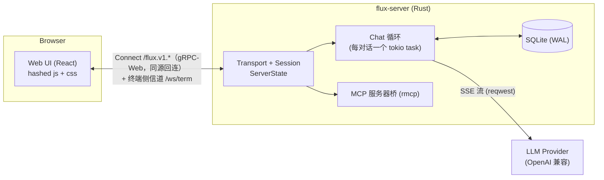
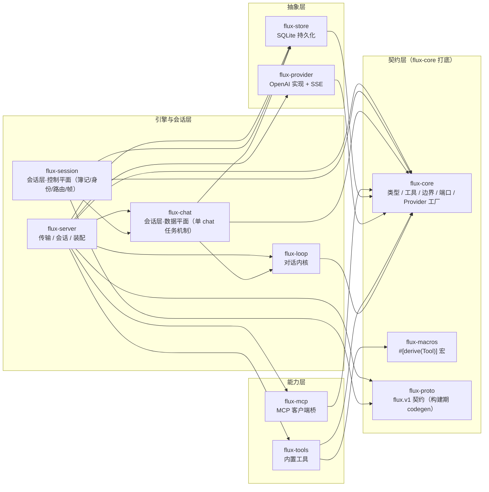
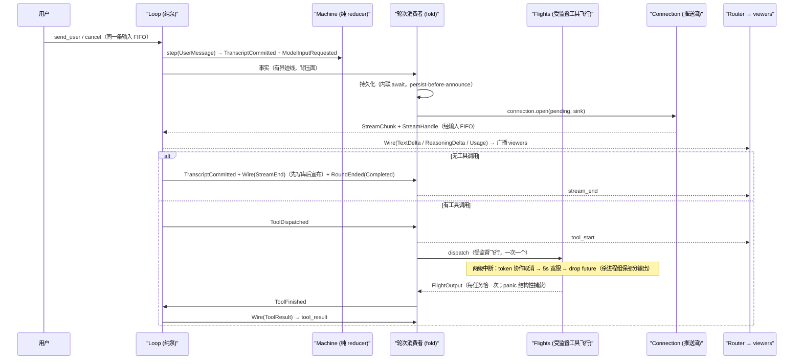
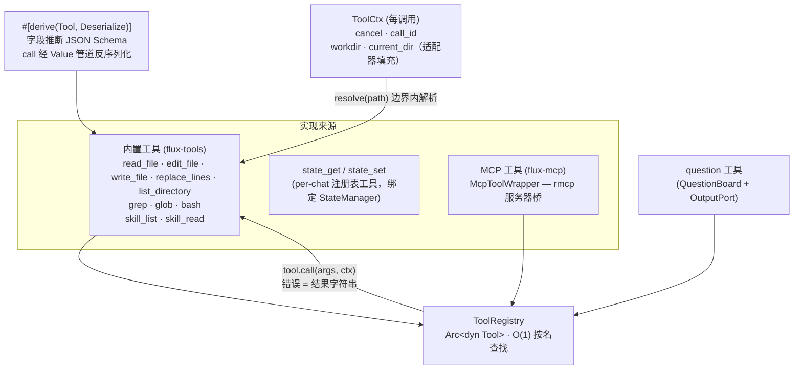
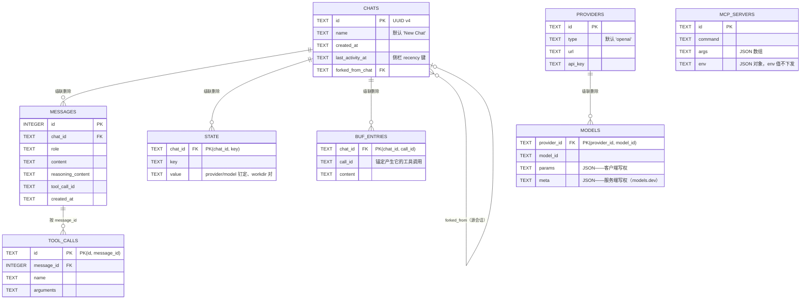
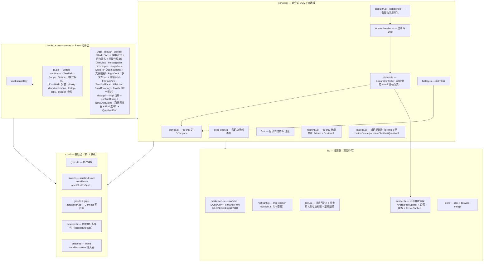
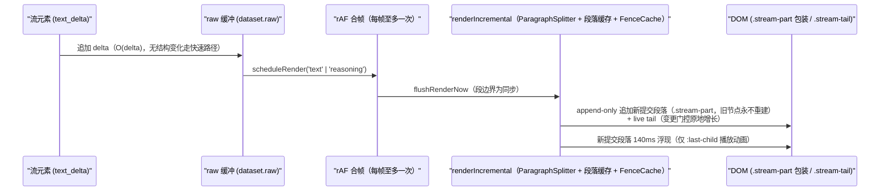

# Flux 架构文档

> English version: [architecture-en.md](architecture-en.md) · 既定取舍：[decisions.md](decisions.md)
>
> 本文档描述 Flux 当前的真实架构。所有图示使用 Mermaid（GitHub 与 VSCode Markdown 预览原生渲染）。

## 目录

1. [系统总览](#1-系统总览)
2. [仓库结构](#2-仓库结构)
3. [后端架构](#3-后端架构)
 - 3.1 [核心概念：ServerState / Chat / Session](#31-核心概念serverstate--chat--session)
 - 3.2 [生命周期](#32-生命周期)
 - 3.3 [对话循环](#33-对话循环)
 - 3.4 [工具系统](#34-工具系统)
 - 3.5 [工具上下文与边界（无审批直接执行）](#35-工具上下文与边界无审批直接执行)
 - 3.6 [沙箱语义：workdir / current_dir](#36-沙箱语义workdir--current_dir)
 - 3.7 [持久化](#37-持久化)
 - 3.8 [Connect 协议与背压](#38-connect-协议与背压)
 - 3.9 [配置](#39-配置)
 - 3.10 [Web UI 静态伺服](#310-web-ui-静态伺服webrs)
 - 3.11 [终端侧信道](#311-终端侧信道wsterm)
4. [前端架构](#4-前端架构)
 - 4.1 [分层结构](#41-分层结构)
 - 4.2 [状态管理](#42-状态管理)
 - 4.3 [流式渲染引擎](#43-流式渲染引擎)
 - 4.4 [构建与测试](#44-构建与测试)
5. [关键设计决策](#5-关键设计决策)
6. [开发与验证](#6-开发与验证)

---

## 1. 系统总览

Flux 是一个通用编码 Agent 框架：Rust 编写的本地服务器负责 LLM 对话循环、工具执行与持久化；浏览器 Web UI（React + Tailwind，由 server 静态伺服）负责聊天 UI 与流式渲染。两者通过 Connect 协议（gRPC-Web）通信。



要点：

- **模型无关**：对话引擎（flux-chat）只依赖 `flux-core` 的 `Provider` 工厂（`begin` 开出 `Connection`），OpenAI 兼容实现只是当前唯一实现。
- **一条会话级 Subscribe 流多路复用多个对话**：gRPC-Web 单流上可同时活跃多个 chat。
- **默认只绑定 `127.0.0.1`**；无应用层认证——远程暴露经反向代理（TLS + 代理层认证）。

## 2. 仓库结构

Cargo workspace 共 11 个 crate，依赖方向严格自下而上；前端独立于 workspace。



| Crate | 职责 |
|---|---|
| `flux-core` | 内核契约层：纯类型（`Message` / `Role` / `ToolCall` / `CoreError` / `ErrorCode` / `ChatStateKind`）、`WireEvent`（内核输出词汇）、内核 I/O 词汇（`loop_io.rs`：`LoopInput` / `LoopFact` + `RoundOutcome` / `StreamEvent` / `StreamHandle` / `Connection`）、`Tool` trait（`call(arguments, ctx: ToolCtx)`，每调用协作取消上下文 + `call_id` + 沙箱边界）+ `ToolRegistry`、边界解析（`boundary::resolve_path`，`ToolCtx::resolve` 的实现）、内核端口（`ToolPort` 工具执行 + `OutputPort` 适配器侧事件出口）、`Provider` 工厂（零 IO；依赖 serde、serde_json、strum、thiserror、async-trait、tracing、futures、tokio-util）。proto 契约（`flux.v1`）在 `flux-proto`（构建期生成），flux-session 的 router 是 WireEvent → 流元素的唯一映射点 |
| `flux-macros` | `#[derive(Tool)]` 过程宏：字段推断 JSON Schema + `call` 反序列化 |
| `flux-provider` | OpenAI 兼容实现 + SSE 解析，实现 flux-core 的 `Provider` 会话工厂（实例按模型钉定；`begin` 开出 `Connection`） |
| `flux-tools` | 内置工具：文件 / shell / 搜索 / Agent Skills（skill_list / skill_read）+ 共享 subprocess 执行器 |
| `flux-mcp` | MCP 客户端桥：连接外部 MCP 服务器——本地 stdio 子进程或远程 Streamable HTTP 端点——并暴露其工具（启动列表在 DB，UI 管理，persist-first + 即时应用；headers/env 值永不离开服务端）；接收 server 通知——`tools/list_changed` 走「通知钩子 + subscriptions/listen 订阅」双路径（覆盖 spec ≤ 2025-06-18 与 2026-07-28），`notifications/message` 日志转发到 UI |
| `flux-store` | SQLite 持久化（sqlx，WAL：chats / messages / state / providers / mcp_servers） |
| `flux-loop` | 对话内核：纯状态机（`machine.rs`）+ 纯泵驱动（`runtime.rs`：消费输入、步进、按序转发事实）——零 I/O、零 trait 对象 |
| `flux-chat` | 会话层·数据平面：单 chat 任务机制（`chat` 实体 / `domain` 状态与 state 工具 / `handle` 控制句柄 / `spawn` 装配 / `round` 轮次消费者（事实 fold + 飞行监督；Rebuild → 机器门原地重建，任务不退出）/ `tool_exec` 飞行监督库（无独立任务）/ `buf` 溢出缓冲（store 支撑）/ `question` 提问工具 / `reserved` 保留工具名检查）。只依赖 flux-core 端口（`OutputPort`），对控制平面无反向依赖 |
| `flux-session` | 会话层·控制平面：跨 chat / 跨 session 的簿记——`manager`（`ServerState`：全局配置 + chat 缓存 + 身份注册表）/ `ops`（租约·订阅·广播）/ `router`（WireEvent → proto 流元素的映射 + fanout）/ `lifecycle`（懒 spawn 与任务替换）/ `identity`（会话标识·类型化 sink） |
| `flux-server` | TCP 传输（Connect 面 `/flux.v1.*` + 终端侧信道 `/ws/term`）、`grpc/*`（chat/事件/管理/fs 服务的序列化薄层）、装配、CLI（无配置文件）、`ProviderRegistry`（provider 管理：选择 / 实例构建 / 模型探测，实例递入 chat 层）、`McpManager`（MCP 启动列表管理：persist-first + 即时应用） |
| `clients/web` | Web UI（唯一前端）：React 19 + Radix UI + Tailwind v4 + zustand，Vite 构建 |

## 3. 后端架构

### 3.1 核心概念：ServerState / Chat / Session

三个核心概念对应三个文件：

| 概念 | 文件 | 角色 |
|---|---|---|
| **ServerState** | `crates/flux-session/src/manager.rs` | 即 ChatManager：全局配置 + `RwLock<HashMap<ChatId, CachedChat>>` + `identities` 身份注册表（token → `SessionRef`，live 与 detached 同表）+ 每 chat 路由通道。CachedChat 带 `lease`（租约持有者的身份句柄）、`viewers`（订阅集合，键为身份内序号）、`task`（懒 spawn 的 ChatTask）、`router`；Chat ID 为 UUID v4 |
| **Chat** | `crates/flux-chat/src/chat.rs` | 内部对话：内核 `ToolPort` 的实现（存在性 → ctx 边界填充 → 执行 → 输出限幅 + per-chat 工具注册表 + state；持久化是事实迹线的 fold，不是端口），**模型无关**；事件经 `OutputPort`（生产实现为 router sink）发往本 chat 的 viewers |
| **EventPlane** | `crates/flux-server/src/grpc/events.rs` | 会话级 `Subscribe` 流 = 身份生命周期锚：流开 = attach（请求携带 token 则采纳、缺省铸新），首帧 `ready` 携权威 token + leases（resume 握手坍缩进流开），流断 = detach（宽限/reaper 机械不变）；流自带 sink（双队列 + biased pump，控制通道优先）与 30s keepalive 注入（客户端 frame deadline 判半开） |

**关键设计**：任务归 ChatManager（session 无关）；**身份 = `Session` 对象**（`identity.rs`：resume 令牌 `token` + 内部路由序号 `sn` + 当前连接 sink + detached 时刻，全部内聚于一个 `Arc` 句柄）——租约/订阅/路由结构直接持 `SessionRef`，授权 = 句柄等价比较，令牌字符串只在 ready 帧与 token 查找中出现，chat 域零 session 词汇。对话权 = 每 chat 至多一个 `lease`（发消息/取消/应答 question/删除/改名需租约，他人操作被拒 → `ErrorEvent{chat_busy}`（refused RPC 亦映射 failed_precondition status）；busy 元素不含持有者标识——resume token 是 bearer 凭据，绝不进入他人流）；观看权 = `viewers` 集合（ClaimChat 隐含订阅；OpenChat 为 viewer 降级订阅，可并发）。Session 断开 = **detach**：连接 sink 置空（teardown 经 sink 指针比对防陈旧接管）、viewer 注册移除、租约保留 30s 宽限期等流重开采纳（attach 换 sink 并清标记），过期由 reaper 释放租约并从注册表移除身份（任务继续跑）。

依赖注入与测试接缝（为可测试性设计的 trait 层）：

- `OutputPort`：任务的事件出口（`WireEvent`），生产实现为 `ChannelOutput`（转发给本 chat 的 router），测试用假端口；
- `SessionSink`：router 的投递口（类型化 proto 流元素直写），生产实现为事件流的 `StreamSink`（双有界队列 + pump），测试用 `RecordingSink`；
- `Provider` 工厂（flux-core）/ `Connection`：`Provider::begin` 创建有状态会话；`Connection::open(pending, sink)` 把解析后的流事件推进内核输入通道，返回 `StreamHandle` 取消能力；
- `ChatInfoOwned` / `ChatInfoGuard`：缓存快照零拷贝设计——先取下锁快照、释放读锁，再序列化发送，**读锁绝不跨 I/O 或网络发送持有**。

### 3.2 生命周期

```mermaid
sequenceDiagram
 participant C as "客户端 (Browser)"
 participant S as "Subscribe 流 (EventPlane)"
 participant SS as "ServerState (ChatManager)"
 participant CH as "Chat task (懒 spawn)"
 participant DB as SQLite

 C->>S: Subscribe {session_id?}（流开 = attach：宽限期内采纳或铸新；
 每次后续 unary 携 x-flux-session metadata → 同一 SessionRef）
 S-->>C: ready {session_id, leases}（权威身份 + 租约——resume 坍缩进流开）
 C->>S: CreateChat {name, workdir, provider, model}（unary；错误内联）
 S->>SS: create_chat(...)
 SS->>DB: insert_chat
 S-->>C: chats 广播 + CreateChatResponse{chat}（租约+订阅授予创建者；任务懒创建）
 C->>S: ClaimChat {chat_id}（操作者单消息：快照走流 + 订阅 + 租约；他人租约 → 接管，
 原持有者流上收 ErrorEvent{chat_busy}）
 S->>SS: claim_chat(session, chat_id) + DB load_messages
 S-->>C: chat_history / chat_state（流元素，peek seq）
 C->>S: SendMessage {chat_id, message}（需租约；租约空自动认领）
 S->>SS: ensure_task + send_message
 SS->>CH: spawn(init, llm, tools, store, router)
 CH-->>S: text_delta / tool_* / usage / stream_end（router → 流元素广播给 viewers）
 C->>S: OpenChat {chat_id}（viewer 降级订阅：chat_busy 后补发 / gap 重订阅）
 C->>S: CancelRound {chat_id}（门控：仅租约持有者）
 C->>S: CloseChat {chat_id}（完全退出 = 退订 + 还租约）
 C->>S: 流关闭（页面刷新 / 连接死亡）
 S->>SS: detach：清 viewer 注册、租约保留 30s 宽限期等流重开采纳；
 过期 reaper 释放并广播（任务继续跑完轮次后闲置）
```

**任务终结语义**（lifecycle.rs）：无崩溃监督——自研代码承诺不崩溃（fallible 路径全部 Result 化，无自引入 panic），不为「可维护 panic」引入机制。消费者任务在以下情况退出：

1. **事实通道关闭**——回路死亡（输入 FIFO 无发送者）；
2. **控制通道关闭**——handle drop（chat 删除或任务被替换）。

退出时 drop guard 置 done 标志；stale handle 由下一次 `ensure_task` 惰性替换（重生装载全量持久历史，C2）。**引擎重建不是退出**：消费者在机器门触发时原地重建（见下），任务仅在回路死亡或控制通道关闭时结束——其余退出维持无崩溃监督哲学（惰性替换）。错误路径全部走 Result：provider/工具错误 → 流上的 `ErrorEvent`，与终结机制无关；`stream_crashed` 保留为无特定映射 StreamError 的默认 wire code。

### 3.3 对话循环

每个 chat 跑**一条纯两通道回路**：内核（`flux_loop::Loop`）从输入通道消费 `LoopInput`、步进纯状态机、把 `LoopFact`（语义事实迹线）推上输出通道——**零 I/O、零 trait 对象**；所有协作者都是通道对端，由适配器装配：

- **回路**（`runtime.rs`）：机器 + 两通道；输出通道有界（1024）——慢消费者背压整轮而非无限缓冲；每步之后状态变化以 `RoundState` 事实输出（后置真值）；回路持有活跃流的 `StreamHandle`（经输入通道递入的纯取消能力），取消/收尾即 drop——连接的推送立即停止。
- **连接**（`flux-provider`，`Connection` trait 在 flux-core）：每 chat 一个有状态会话（prefix cache），单接口——`open(pending, sink) → StreamHandle`（解析后的事件推进回路输入通道；stall 看门狗与 EOF 截断判定都在连接内）。连接活到下一次机器门触发——真相源变更时消费者在门处**原地 re-begin**（新连接，旧连接随替换 Drop）。
- **工具飞行**（`flux-chat/src/tool_exec.rs`，监督库——由轮次消费者在其 select 循环内直接驱动，**无独立任务、无命令通道**）：`ToolDispatched` 事实 → `tool_start` wire + 受监督 flight（协作 token → 5s 宽限 → 强制 drop，Drop 清理照跑）；完成臂把恰好一个 `ToolFinished` 反馈推回内核输入 FIFO（panic 结构性捕获；结果由监督层统一打 `INTERRUPTED_MARK`）。
- **轮次消费者**（`flux-chat/src/round.rs`，事实迹线的 fold）：每 chat 一个任务（活整个 chat 生命周期）按序解释迹线——持久化 fold（`TranscriptCommitted` → 写入数据库，内联 await 保持 persist-before-announce；单条用户消息的提交额外公告 `message_persisted` 携带所分配的行 id，发送方客户端得以命名自己的 live 气泡）、路由 fold（`Wire` 事实 → router）、provider 触发（`ModelInputRequested` → `connection.open`）、工具派发与飞行监督（见上条；`InterruptTools` → 同一折叠循环内取消在飞 token）、**引擎重建**（唯一的控制命令：`Rebuild` 到达即向内核发 `Hold`——Idle 立即触发、活轮次武装到收尾（其后排队的轮先跑完）——在 `GateReleased` 处**原地重建**：以与 spawn 相同的装配函数重装注册表（当前全局注册表），以携带的新 provider 实例在全量持久历史上 re-begin 连接）。消费者**从不改写运行中的轮次**——重建只落在机器声明的边界上，任务永不因重建退出。



- **纯 reducer**：`Machine::step` 是全函数——每个 (state, event) 对都有定义；策略（何时中断、何时不发）全在 reducer，机制（token/drop）全在消费者驱动的飞行监督；
- **工具 flight**：每个工具调用 spawn 为受监督任务（消费者 select 第三臂的 JoinSet——监督库 `tool_exec`，无独立任务/通道）；完成经消费者收集后以 `ToolFinished` 输入回到机器（恰好一次反馈是构造性质），`catch_unwind` 把工具 panic 变成 transcript 错误结果；
- **两级中断**（`InterruptTools` 事实 → 消费者在折叠循环内取消在飞 token）：第一级取消在飞工具的协作 token（`ToolCtx`）——工具及时停止则贡献部分输出（subprocess 杀进程组 + drain 管道，部分输出进 transcript；MCP 停止等待）；第二级对忽略 token 的工具在宽限期（`INTERRUPT_GRACE`，5s）后 drop future（abort 等价，Drop 清理照跑）。中断结果由监督层统一标记（`INTERRUPTED_MARK`）——**工具永不自报取消**；
- **工具顺序单飞**：一轮内多个工具调用严格按序逐个派发（可观察的确定语义）；
- **取消 = 普通队列事件**：`Input::Cancel` 与消息共用一条 FIFO 通道。流式中 → `Cancelled` wire 事件收尾；工具飞行中 → 中断在飞工具 + `cancelled` 吸收标志（剩余批次 void），中断结果双写后 `Cancelled` 收尾；Idle 时静默 no-op；队列随取消清空（停即全停——R1 interrupt-send 保证先 cancel 后发消息：服务端把两个输入背靠背写进同一 FIFO，取消后发送的轮照常运行）；
- **轮次队列（mid-round 用户轮）**：`UserMessage` 在流式/工具飞行中到达**入队而非丢弃**（FIFO）——在收尾当前轮的**同一步**内开新轮，边界以步内事实补报（`RoundState(Idle)`——loop 的转换检测发不出，因该步重新进入 Streaming；随后的 `RoundState(Streaming)` 恢复快照真相）。内核自己串行化用户轮：R1 interrupt-send 把 cancel+消息融进单个 RPC，顺序依赖架构性消失。不变量：机器从不带着非空队列停在 Idle——武装的门顺延到排队轮的收尾（该轮属于重建前上下文），门只在队列排空后触发；
- **引擎重建（通用重启原语，机器门）**：内核的全部认知收缩为一个门原语——`Hold`（Idle 立即触发并发 `GateReleased`——门触发即排空：决策前发送的一切都按 FIFO 先于 Hold 入队；活轮次武装到收尾）与 `GateReleased`（门触发的事实；队列排空后门才触发，排队轮先跑完）。选择与语义全在轮次消费者（见 3.3 轮次消费者 bullet）：变更方（session 层的 SwitchProvider / MCP 管理）**先写真相源**（请求时持久化 pin、变更全局注册表）并公告 wire 通知，再 `Rebuild`（provider 切换携带新实例）；消费者在门触发处**原地重建**——以与 spawn/hydration 同一条装配路径重装注册表与连接（全量持久历史 + 携带实例 + 当前全局注册表），随后注入待写入的 follow-up。活轮次永不中断；变更与生效解耦；引擎永不因重建而死亡，重建期间到达的发送直接入内核队列（旧连接上跑完，语义 FIFO 自洽）。**从某条消息重启对话 = fork**（见 ChatService）：新会话复制源 transcript 至该用户消息**之前**（重做轮在用户重发时才回到 fork——客户端把其内容预填进 fork 的输入框），源原样不动——没有原地归档；
- **`stream_end` 表示**：本轮助手消息完整流出并已持久化，前端据此收尾渲染；可选 `finish_reason` 携带提供方结束原因（`length`/`content_filter` 表示回答被截断，前端显示中性提示而非视为完整）。reason 只在轮末宣布一次：工具轮次首条流 `End` 后继续执行，其 reason 按设计丢弃，最终 `StreamEnd` 携带后续流自身的 reason（正常收尾为 `"stop"`）。

### 3.4 工具系统



- **工具上下文 + 纯执行（无审批直接执行）**：沙箱边界（`workdir` / `current_dir`）经 `ToolCtx` 作为**调用上下文**到达工具——内核构造 ctx 时只填取消令牌与 call_id（内核边界无关）；`Chat`（ToolPort 适配器）在派发点从权威 state 填充边界字段后调 `tool.call`。工具内经 `ctx.resolve(path)` 解析路径参数（绝对路径必须落在边界内，相对路径拼接边界；不存在路径走最深已存在祖先 + 尾部拼接）。解析/执行失败都是工具结果字符串（`Error: {reason}`），模型可见并自纠——**不阻塞轮次**。工具是纯执行器：不接触 state 存储；schema 不携带任何边界参数，LLM 传入的多余键不参与解析——伪造路径参数结构上无效。
- **协作取消契约**：`Tool::call(arguments, ctx: ToolCtx)` 携带内核所有的 `CancellationToken`——用户中断时工具应尽快停止并返回手头的部分输出（bash 转发给 subprocess 执行器：杀进程组 + drain 保留部分输出；MCP 停止等待请求）。忽略 token 的工具由内核宽限期后强制终止。工具结果永不自述取消——中断标记由内核统一添加。derive 宏把 ctx 透传给 `execute(ctx)`。
- **Value 参数管道**：args 全程 `HashMap<String, Value>`——JSON 解析一步到位，数字/嵌套对象原样保留（MCP 嵌套参数直达）；工具结构体保持强类型字段（`read_file` 的 `offset`/`limit` 仍为 `usize`，schema 仍为 `integer`），LLM 契约零变化。宏 body 经 `Value::Object(args)` 一步反序列化。
- **schema/解析单源**：8 个内置工具都是字段结构体，宏从字段（含 doc comment）推断 JSON Schema，`call` 自动反序列化参数（失败 → `CoreError::InvalidArguments`）并透传 `ToolCtx`；`#[tool(skip)]` / `#[tool(required)]` / `Vec<T>` 推断保留；`#[serde(default)]` 字段不进 `required`。
- **glob 以 `current_dir` 为基**：glob 的搜索根 = ctx 的 `current_dir`（与 bash 的 shell cwd 语义一致——模型用 `state_set current_dir` 挪动后 glob 跟随）；bash 的 cwd = `ctx.current_dir`（空 → `InvalidArguments`，fail-closed）。
- **Agent Skills（skill_list / skill_read，工具式渐进披露）**：skill = 自包含能力包（含 `SKILL.md` 的目录：frontmatter `name`/`description`，正文为指令）。**无任何 prompt 注入**——工具自身的 description（随每请求的 `tools` 数组对模型可见）是唯一常驻面；`skill_list` 每次调用即时扫描（无重启语义），`skill_read` 才加载内容。位置：项目 `<workdir>/.flux/skills/`（边界内）+ 全局 `~/.flux/skills/`（用户安装的可信内容，同 MCP 服务器的信任层级）；同名时项目覆盖全局。`skill_read` **按名寻址**——模型永不传路径，请求文件相对技能根做严格包含检查（canonicalize + 前缀，symlink 安全），读取结构上不可能离开技能目录；
- **输出溢出缓冲（集中式、锚定、持久化）**：所有工具结果经 `Chat::bounded_output` 统一截断——超 8000 chars **写穿透传**至每-chat `buf_entries` 表（按产生它的 tool call id 锚定，`ToolCtx::call_id`），返回 head + 该 call id 引用；模型用 `buf_read {ref, offset, limit}`（字符制分页，页 ≤ 6000 chars，无递归；读穿 store）读取余下。**从不覆盖、无代际清空**：引用自描述且稳定（transcript 里的就是同一 id），跨引擎重建与进程重启可读，无需任何外壳传递（内存缓冲已删，store 是唯一真相）；生命周期 = chat 生命周期（transcript 只增不减，无归档边界，无需 GC）；fork 复制其副本携带的调用条目，`buf_read` 引用在 fork 内继续可读；chat 删除级联。entry ≤ 1M chars。per-tool 上限并入集中层：bash 8KB / read_file 行长与总量截断删除；grep 保留匹配窗口塑形 + 匹配数 500；glob 500 条。grep 路径以搜索根为基准；read_file 页脚 `end` 为最后展示行（含），恰好剩 `limit+1` 行时必触发；
- **MCP**：自由函数 `connect_with_peer` 连接外部 MCP 服务器（`McpServerConfig` 枚举：`Stdio` 子进程 / `Http` Streamable HTTP 端点——rmcp `StreamableHttpClientTransport`，自定义 header 携带鉴权，`allow_stateless` 接受无会话服务器、`reinit_on_expired_session` 在 404 会话过期时传输层内自愈重握手；代理随进程环境 `http_proxy/https_proxy/all_proxy` 自动生效（loopback 目标豁免——`127.0.0.1`/`localhost` 是本地服务，与 stdio 子进程同层，绝不绕道代理）；30s 初始化超时），获取其工具列表包装为 `McpToolWrapper`（单次调用 60s 超时）；`McpSession` 为 RAII 保活守卫（两传输共用，`QuitReason::Closed` 在 HTTP 下即连接断开，由同一 supervisor 退避重连——传输层内的 SSE 重试/会话恢复是内圈自愈，supervisor 是外圈）。启动列表在服务端数据库（UI 管理，persist-first + 即时应用：`McpManager` 持全局注册表引用——连接成功即注册、移除即按 owner 精确注销，随后扇出引擎重建；连接失败随 ack 内联、行保留，启动时以 warn 跳过、不阻塞——管理入口始终可用，可修改后重试）。

### 3.5 工具上下文与边界（无审批直接执行）

flux 的设计立场：**工具执行零审批**——没有确认弹窗、没有记忆白名单、没有 fail-closed 缺省。审批层名下的职责以决策无关的机制承接：路径正确性 = 边界内解析（工具调用上下文）、写入规范化 = state 写入点、「等用户输入」= `question` 工具。信任模型见「Trust model」小节（AGENTS.md）。

`ToolCtx`（flux-core，每调用一次）：

| 字段/方法 | 来源 | 语义 |
|---|---|---|
| `cancel: CancellationToken` | 内核构造 | 用户中断令牌（协作取消 + 宽限期强杀） |
| `call_id: String` | 内核构造 | 内核分配的工具调用 id（`question` 配对应答） |
| `workdir: PathBuf` | 适配器（Chat）填充 | 沙箱边界——chat 创建时携带、canonical、只读 state |
| `current_dir: PathBuf` | 适配器（Chat）填充 | 瞬态 shell cwd——canonical、必在边界内、bash/glob 消费 |
| `resolve(input)` | 工具调用 | 边界内解析路径；越界/悬空 symlink/`..` 尾部 → 工具错误 |

**模型提问（`question` 工具）**：审批弹窗的生态位继任者——轮次内阻塞、租约持有者应答、优先控制通道直达 + 停靠/claim 重投——但内容方向反转：问题文本与选项全部由 agent 产出，用户回答作为工具结果返回。工具经 `QuestionBoard`（每 chat `HashMap<id, oneshot::Sender>`）等待答案，`select!` 协作取消 token（用户取消 → 内核统一标记中断，且工具从 board 注销自身条目——map 不泄漏，陈旧应答按未知静默丢弃）。Esc/关闭 = 中性 `DISMISSED` 应答文本，轮次继续。`id` 由 `ToolCtx.call_id` 语义配对（内核 dispatch 时填入）。

### 3.6 沙箱语义：workdir / current_dir

- **`workdir` = 沙箱边界（只读 state）**：chat 创建时携带、canonicalize 后持久化进 state 表（`list_chats` join 它下发给 `ChatInfo.workdir`）；`StateManager` 加载时把 `workdir` 提取为**固定字段**，可变 map 中不存在——`set("workdir", …)` 在唯一写入点直接拒绝。`state_get` 经固定字段只读透出（模型自省）；跨项目 = 开新 chat。
- **`current_dir` = 瞬态 shell cwd（可写 state）**：播种值 = workdir；模型用 `state_set` 挪动，影响 bash（执行 cwd）与 glob（搜索根）。**规范化在写入点**：`state_set` 工具经 `ctx.resolve`（边界包含检查）+ canonicalize（必须已存在——它要当 spawn cwd），存储值与后续使用都落在 resolved 路径上（裸 symlinked 路径在 macOS /Users 会让文件工具的词法比对全部误拒——写入时 canonical 化消除这类分歧）。
- **路径解析安全语义**（`boundary::resolve_path`，flux-core 单一实现，flux-tools 与 flux-chat 共用）：存在路径直接 canonicalize；不存在路径走「最深已存在祖先 + 尾部拼接」——回溯中显式拒绝 `..`/`.` 尾部件（`starts_with` 不归一化 `..`，不能依赖 `file_name` 对 `..` 结尾返回 None 的附带行为）并拒绝悬空 symlink（`symlink_metadata` 区分「存在」与「缺失部件」——否则后续写操作会顺着链接把文件建到边界外），覆盖**不存在路径的 `..` 越界**（如 `a/../../../../etc/new`）与 **symlink 祖先逃逸**（如 `escape_link/newfile.txt`）。
- **`state_set` 的 key 空间是开放的（设计意图，不应作为缺陷修复）**：schema `enum` 只列出已知键作 LLM 引导，执行器不拒绝未知键——`state_set` 同时是给 AI 的跨轮次通用 KV 持久化通道（任意 key 读写；`state_get` 未知 key 返回空串而非错误，读写对称）。边界语义只由 `workdir`（只读）/ `current_dir`（写入点规范化）两个权威键承担，新键是惰性数据。
- **fail-closed 缺省**：ctx 边界为空（理论上仅测试场景——生产 `create_chat` 在 workdir 持久化失败时中止创建）时，`resolve` 与 bash/glob 的空边界检查直接报错，绝不回退到服务器进程 cwd。
### 3.7 持久化

`flux-store`：sqlx `SqlitePool`（WAL，4 连接）。每连接 PRAGMA：`journal_mode=WAL`、`synchronous=NORMAL`、`foreign_keys=ON`、`busy_timeout=5000`、`cache_size=-65536`、`mmap_size=268435456`、`temp_store=MEMORY`、`wal_autocheckpoint=2000`。打开时一次性确保 `auto_vacuum=INCREMENTAL`（存量 NONE 模式库的重建 VACUUM 发生在监听绑定之前）；启动后 `PRAGMA optimize`；每小时条件 `incremental_vacuum`（freelist ≥ 1000 页，普通短写事务——服务期内不再有整库 VACUUM 的持锁窗口）。

单一合并迁移（`crates/flux-store/migrations/001_consolidated_schema.sql`）：最终形态一次建表。未发布——无遗留数据库负担，schema 变更就地改此文件（既定「升级 = 重建」取舍），sqlx 迁移机制保留给将来的发布版本：



要点：

- `append_messages` 为事务批写（消息 + tool_calls 一次提交）；
- `messages` 带 `(chat_id, id)` 索引；
- state 以预序列化 JSON 字符串存储，加载时容错反序列化；
- 用量不写入数据库：`usage` 事件随每轮送达，前端累计为紧凑的 ↑/↓/R/W 总量。

### 3.8 Connect 协议与背压

**协议面**：`proto/flux/v1`（buf 管理，STANDARD lint 为命名权威）是**唯一契约源**——Rust 绑定由 `flux-proto` 构建期生成（tonic/prost，OUT_DIR），TS 绑定由 web 包 prebuild/pretest 钩子 `buf generate` 派生（不入库）；CI 重派生 + `buf breaking` + 新鲜度检查。传输 = **gRPC-Web over HTTP/1.1**（tonic-web 挂同一 axum router；浏览器走 `@connectrpc/connect-web`），单端口与静态站共存。

**身份与生命周期（R3）**：会话级 `Subscribe` 流是身份锚——流开 = attach（`SubscribeRequest.session_id` 宽限期内采纳或铸新），首帧 `ready` 携权威 token + leases（resume 握手坍缩进流开），流断 = detach（宽限窗口与 reaper 机械不变）。服务端每 30s 注入 keepalive 帧，客户端 frame deadline（3×）判半开重开流。unary 调用身份走 `x-flux-session` metadata → `session_leases` 解析出**同一个** `SessionRef` 对象；租约门拒绝映射标准 status（busy → failed_precondition、未知 → not_found、无/未知 token → unauthenticated trailers-only）。

**错误模型（D4'）**：应用级失败随应答内联 `error` 字段（管理面校验、创建校验、fs 浏览——请求作用域的 UI 数据）；传输/基础设施失败走 gRPC status；流上 `ErrorEvent` 元素（code 枚举）承担应用级错误通道（轮错误、claim 抢占的原持有者降级、慢 viewer gap 通知）。

**服务方法**（完整语义见 AGENTS.md 协议表；此处列结构）：

> **ForkChat（从消息开分支）**：`ForkChat{chat_id, fork_point}` → 新会话复制源
> transcript 至该 USER 消息**之前**（含 tool_calls 与 buf 条目，调用 id 原样保留），
> 继承 workdir 与 provider pin；fork 点是要重做的那个 user 轮——它在用户重发时才
> 进入 fork（客户端把其内容预填进 fork 的输入框），新生的 fork 是停在首轮之前的
> 分支；**源会话原样不动**——fork 是非破坏性读取 + 新建，任何 viewer 都可发起
> （无租约门），新会话租约授予发起者，ack 即 `chat_created` 载荷，随后的 claim
> 快照投递副本历史。它是"从某条消息重启对话"的机制（取代旧 rebase 的原地归档
> ——该语义已删除）。

| Service | RPC |
|---|---|
| ChatService | CreateChat · ListChats · OpenChat · ClaimChat · CloseChat · DeleteChat · RenameChat · SendMessage · CancelRound · ForkChat · SwitchProvider · AnswerQuestion |
| EventService | Subscribe（流：ready → 事件 + keepalive → 断开即 detach） |
| FileSystemService | FsList · FsRead |
| ProviderService | ListProviders · GetModels · AddProvider · RemoveProvider |
| ModelService | ListModels · SaveModel · RemoveModel · SyncModels |
| McpService | ListServers · AddServer · RemoveServer |
| SkillService | ListSkills · AddSkill · RemoveSkill |

**流元素**（`SubscribeResponse {chat_seq, chat_id, kind}`，22 变体）：`ready{session_id, leases}`（首帧）· `keepalive` · `text_delta` / `reasoning_delta` / `stream_end{finish_reason?}` / `stream_cancelled` · `tool_start` / `tool_result`（前置 `tool_call_preview`——模型仍在成形调用时的身份+参数流预告，客户端先渲染 pending 卡，`tool_start` 原位升级；轮终未升级即作废，不持久化）· `usage` · `question_required`（控制车道）· `chat_history` / `chat_state`（claim/open 快照**走流单点投递**——与需对账的事件同源有序）· `error` · `provider_switched` · `message_persisted{id, content}`（用户消息写入数据库后受理时即公告——发送方客户端按内容匹配自己的 live 气泡并附加 fork 入口，行 id 即 ForkChatRequest.fork_point）· 全局广播 `chats` / `chat_created` / `providers` / `models` / `mcp_servers` / `skills`。

**R2 序号对账**：每 chat 单调 `seq`，router fanout 消耗（fetch_add 旧值，所有 viewer 同帧同号）、claim/open 快照窥视（peek 不消耗）。客户端记录快照 seq 后丢弃**严格小于**它的受控内容元素（快照后首个事件复用同值——等于快照序的元素是快照后第一个活元素）；错误/提问/快照/全局广播不参与门控（类型作用域）。

**背压与掉帧**（StreamSink + 每 chat router，见 `grpc/events.rs` / `router.rs`）：

- Chat 输出经每 chat 路由通道（有界 1024，满则阻塞任务）→ router 构造一次 proto 元素（R2 seq 直写 `chat_seq` 字段——JSON 信封与 `stamp_seq` 注入已死）、广播给每个 viewer 的 sink（**单一掉帧面**：流的 content 队列 1024）；
- 内容发送失败（sink `send == false`）→ 标记 viewer 掉帧：增量元素静默丢弃至边界事件/重订阅，并经**控制通道**发 `ErrorEvent{stream_gap}`——控制队列（16）由 pump 的 biased select 优先排空，饱和下仍必达；慢 viewer 不影响他人；
- 边界事件走内容路径保序并清除掉帧标记；饱和时边界元素本身也可能丢——客户端以 gap 通知触发 reload 自愈；
- question prompt 经控制通道直达租约持有者（无持有者时停靠、claim 重投；**轮边界清除停靠副本**）；
- router 在每个非 delta 事件上刷新内存缓存的 `last_activity_at`（delta 排除）；
- 流的 sink 契约 = `SessionSink`（`send` / `send_control`，try_send 语义永不 await 网络）；pump 退出（客户端断开/请求 future 被 drop）→ 以**同一 sink Arc** 执行 detach（陈旧接管守卫 = ptr_eq——被采纳替代的旧流 teardown 自动 no-op）。

`ErrorCode` 枚举：`chat_busy` / `chat_not_found` / `stream_crashed` / `stream_gap` / `invalid_request` / `internal` / `provider_connection` / `tool_execution` / `invalid_arguments`（`stream_gap` 为通知语义——慢 viewer 掉帧，可 reload 恢复）。

### 3.9 配置

**服务端没有配置文件**——一切配置是 CLI flag（进程级）或服务端数据库（实体级，UI 管理）：

| CLI flag | 默认 | 说明 |
|---|---|---|
| `--host HOST` | `127.0.0.1` | 绑定地址（无应用层鉴权——对外暴露只能走自带鉴权的 TLS 反代） |
| `--port PORT` | `8080` | 监听端口（Connect 面 / 终端侧信道 / web UI 同一端口） |
| `--db-path PATH` | `~/.flux/flux.db` | SQLite 数据库（chats / providers / MCP 启动列表）；无 HOME 时回退 `./flux.db` |
| `--preamble TEXT` | 内置通用提示 | 系统提示 |
| `--no-web` | （web 默认伺服） | 无头；UI 与 Connect 面同一监听端口，无独立端口 |
| `--web-assets-dir PATH` | 二进制旁 `web-ui/`（无则无静态站） | UI 构建产物目录覆盖（CLI 值原样使用） |

数据库内的实体经 UI 管理（Connect RPC，失败内联返回，成功广播）：**Provider 注册表**（Providers 对话框；纯端点 id/url/api_key——不带 model，模型是 CreateChat / SwitchProvider 的必填钉定；api_key 永不下发）与 **MCP 启动列表**（MCP 对话框；**persist-first + 即时应用**——连接成功注册进全局注册表并扇出引擎重建，spawn 失败的行保留、下次启动重试；env 值只存不下发）。超时（connect/read 各 30s）为常量：read 超时逐读 idle 兜底，活着的长 SSE 流不被总时长误杀。

workdir 说明：chat 创建接受 server 进程可读的任意目录（server 以启动用户权限运行，UI 的目录选择器按此浏览；真隔离由 OS/容器负责）。

### 3.10 Web UI 静态伺服（`web.rs`）

浏览器宿主 = 又一个 viewer/lease 持有者：页面经 Connect 面回连 agent（同一租约模型），工具始终在 server 进程内执行。静态层是**纯叶子**——只伺服文件，不代理任何请求。**单一 axum (hyper) 监听器承载一切**：Connect 服务（`/flux.v1.*`）+ 终端侧信道（`/ws/term`）+ `/` + `/assets/*` 静态站点共用 `--port`，页面同源回连：

- **同源连接**：无模板注入——transport baseUrl 即页面 origin（gRPC-Web over http/1.1；TLS 反代部署即 https）；
- **泛化资产伺服 = tower-http**：`ServeDir` 按名伺服构建产出的**任意**文件（MIME 推断、条件请求、HEAD/405、遍历守卫全部由框架负责）+ `CompressionLayer` 按需 gzip（内容哈希文件名 → `Cache-Control: immutable`，压缩成本只落在冷加载）。缓存/安全头全部 crate 原生 `SetResponseHeaderLayer`：资产 immutable、index.html `no-store`（每请求 `tokio::fs` 读取——重建无需重启即被拾取）、CSP + nosniff 覆盖所有路由与 fallback（`img-src 'self'` 不可或缺——页面走 http，缺它同源 favicon 会被 CSP 拦截）。不做启动期构建校验（T-06）：构建不完整在**请求时**暴露——index 500 + warn 日志、缺失资产 404。构建端为**代码切分的多 chunk**（入口 + hljs 预取 + Files 树按需，见 4.4），dist/index.html 的资产引用由 vite 注入；
- **CSP**：严格姿态（`default-src 'none'`、脚本限 self + 主题预涂装内联脚本的 sha256 哈希——不用 `unsafe-inline`、`img-src 'self' https: data:`、`font-src 'self'`（内置字体）、`connect-src 'self'`、inline style 放行、禁 frame），`nosniff`；哈希与 index.html 的配对由单测自检（构建存在时）；
- **资产解析链**（`resolve_assets_dir`，附单测）：`--web-assets-dir` → 二进制旁 `web-ui/`（打包分发布局）→ 无（纯 Connect + 终端，启动日志注明）。无 CWD 相对的仓库路径猜测——硬编码 `clients/web/dist` 会随启动目录静默生效/失效。UI 默认伺服（`--no-web` 无头）；开发走 `run-server`：dist 缺失时构建并恒传绝对路径旗标，不依赖进程 CWD。

workdir 选择器：chat 创建接受任意可解析目录（server 以启动用户权限运行；真隔离由 OS/容器负责）。UI 经 `FsList` / `FsRead` 浏览/预览文件系统。

**文件 Explorer**：侧栏 Files tab 显示活跃 chat 的 workdir 树——react-arborist（Radix 无 tree；成熟 React 树自带键盘导航/虚拟化/a11y），目录按需懒加载（`onToggle` → `FsList`，children=null 为未加载标记）+ 工具条（workdir 路径、手动刷新按钮 + 固定 15s 自动刷新——对已加载目录原地重列，展开状态保留）+ 文件以 **tab** 形式在右坞打开（`RightDock`：多文件预览 + 终端 tab；**ChatHeader 上的 dock 直达开关**（PanelRight，aria-pressed）+ Ctrl/Cmd+J，空态内联“新建终端”动作——打开 dock 不必先开文件/终端；`.md` 文件经共享 markdown 管道渲染 + Raw 切换；截断徽标带大小提示——server 上报完整 `size`，预算 256KB、行对齐 UTF-8 安全截断）；浏览/读取失败上统一 toast 栈（`Toasts.tsx`），行与面板只留中性占位；拖拽禁用（这是浏览器不是文件管理器）。条目携带 git 工作区状态（`fsbrowse` 每次列目录在 blocking 线程池跑一次 `git status --porcelain -z`——pathspec 限定被列子树、`-unormal` 折叠 untracked 目录（避免 node_modules 规模树的输出爆炸）、被列目录自身 untracked 时全部条目标记 untracked：文件直接状态、目录聚合子树最强信号；名称着色 + 字母徽标 M/A/U/C，随刷新更新）

### 3.11 终端侧信道（`/ws/term`）

每 chat 可开**多个**交互式终端（dock “+” 或 dock 空态的 New-terminal 动作按需创建，绝不自动 spawn；dock 本体由 ChatHeader 开关直达）：服务端 e4pty 分配 PTY（tokio 异步，Unix openpty + Windows ConPTY），前端 xterm.js 渲染。**专用 WebSocket**——终端 I/O 是高频二进制，绝不与聊天帧混流；同一监听器，升级路由 `/ws/term`。刷新重连时服务端回放 256KB drop-oldest scrollback 环形缓冲（actor 持有，hello 帧之后回放），detach 期间的输出在客户端重建。**退出闭环**：shell 退出 → `exited` 帧 + entry 移除 + socket 关闭（EOF 与 wait 双通道统一经 finish 收尾——select 随机臂不再可能丢帧；前端 status='exited' 时 onclose 守卫不重试）。

- **帧**：binary = 双向裸 PTY 字节；text = JSON 控制 帧。客户端首帧必须是 **auth 握手帧**——`{type:"auth", session, chat, term?}`（坏帧/迟到/缺失 → `error` + 关闭）；此后 server→client `hello {term, attached}` / `exited {code}` / `error {message}`，client→server `resize {cols, rows}` / `close`；
- **身份与作用域**：auth 帧的 `session` 按流采纳同款可采纳性规则**只读校验**（终端永不采纳身份）；token 绝不进 URL（query 参数会落入访问/代理日志）；cwd = chat 的 workdir；shell = `$SHELL`（缺省 bash；Windows PowerShell），注入 `TERM`/`COLORTERM`/`TERM_PROGRAM`；
- **会话身份复用**：页面刷新断开 socket 但 PTY 存活；新 socket 的 auth 帧携带 `term`（客户端按 chat 存 sessionStorage）在宽限期内重连同一 PTY（脱连期间输出不回放）；身份被 reaper 收割时其终端一并终止；
- **生命周期**：reaper 定期清扫「脱连超宽限 / 身份已失效 / chat 已删除」三类；Kill = e4pty 显式终止（`PtyCtl::kill`——SIGKILL / TerminateProcess，e4pty 0.3.1）+ `wait` 收取退出码，并以常规 `exited` 帧送达已连接 socket；随后的句柄丢弃清剿幸存者（master 关闭 → SIGHUP）；不持久化、不进内核、无租约门控（同源信任——这是给人用的 UI 功能，不是模型工具）。

## 4. 前端架构

### 4.1 分层结构

唯一前端在 `clients/web/`——依赖方向**向内**组织（上层 → 下层，下层零 UI 依赖）：



- `core/`：类型、状态、连接——可独立单测；
- `lib/`：纯函数，无副作用（渲染函数注入 `render` 回调以便测试）；
- `services/`：命令式逻辑；服务端消息按 `dispatch.ts` 分发——`handlers.ts` 表驱动注册协议级 handler（键经 `satisfies` 编译期校验），流式 DOM 更新走 `stream-handler.ts`；
- 流式期间**绕过 React 直接命令式改 DOM**（性能边界，见 4.3）；
- **组件栈**：React 19 + zustand（状态）+ Radix UI（dialog/dropdown-menu/tooltip/tabs——shadcn 惯例封装）+ Tailwind v4（`@theme inline` 把 `--fx-*` token 桥接进工具类）+ react-arborist（Explorer 树）。行为组件零手写——成熟组件库承载全部交互难点（焦点陷阱/Esc/outside-click/roving tabindex/定位翻转）；
- **对话框第一方化**：`services/dialogs.ts` 以 promise 型 `confirmDelete`/`pickNewChat`/`askQuestion` 承载确认/新建/提问能力，`components/dialogs/impl.tsx` 在 mount 时注册 UI 实现（Radix 模态渲染进 body overlay，各自持有 React root；模型提问的内联卡按 **chat id 挂进该 chat 自己的 pane**——后台会话来问题时 toast 提示，pane 清除/删除经 pending-question 注册表把悬挂应答以 DISMISSED 收束，绝不悬挂；同一 chat 的新问题取代旧的）。测试经 `setDialogImpls` 注入 stub；
- **控制原语层**：`components/ui.tsx`（Button/IconButton/TextField/Badge/Spinner）是全部控件的唯一样式权威——只消费 `--fx-*` token 与标尺（`--fx-radius-*`、`--fx-control-h`）；全局 `:focus-visible` 焦点环 + 覆盖滚动条统一视觉；
- **TopBar**：恒定可见的全局顶栏——toggle → 品牌标 → 流式指示（点击=取消）→ 连接（断线=重连按钮）→ MCP 通知铃（未读徽标，ring 上限 100）→ Settings 齿轮直开单个对话框（Providers/MCP/Skills 三个 tab 分节，懒加载 chunk，会话内记住上次分节）→ 主题切换（auto/dark/light 循环，localStorage 持久化，index.html 内联脚本首帧前应用——无闪烁）；不携带任何 chat 状态，布局不随活跃 chat 跳动。
- **ChatHeader**：会话头行（消息列上方）——chat 名/mono workdir → spacer → 每-chat token 用量；会话身份住这里，不在 TopBar；
- **可折叠侧栏**：Ctrl/Cmd+B + 栏内 toggle；移动档（<768px，唯一断点）转抽屉（backdrop 关闭、选中自动收起、**Escape 关闭**——抽屉是最顶层 surface，先于 round 取消；打开时主列与右坞 **`inert`**（`useCoveredByDrawer`：键盘/AT 焦点不落到覆盖层后面，TopBar 的开关保持可达））；桌面拖拽或 separator 方向键 ±24px 调宽 160–360px 持久化。**宽度权威在 app.css 的外壳布局段**（`#sidebar { width: var(--fx-sidebar-w) }` + `overflow: hidden`）——tab 切换/新建对话/树加载永不反推宽度（app.test 钉住）；拖动期间宽度直接走 CSS var（pointermove 零 React 渲染），pointerup 才提交 store + 持久化，pointercancel 提交最后移动宽度并拆卸（cancel 事件坐标不可信）；拖拽与键盘共用同一 spec（`useEdgeResize`/`edgeResizeKeys`），separator 暴露 splitter ARIA（tabindex + `aria-valuenow/min/max`）。新聊天按钮 + 客户端过滤（name/workdir 子串）；行操作（改名/删除）收敛为 Radix DropdownMenu 的 ⋯ 菜单（危险项红色）；改名走行内编辑器（受控 input，Enter/失焦提交、Esc 还原）；
- **对话列单一宽度源**：`--fx-chat-max`（780px）同时约束 `.chat-pane`、composer、连接/只读横幅与滚动到底部按钮的右缘锚定——宽窗口下输入框与消息列逐像素对齐，永不漂移；
- **会话列只溢出不收缩**：`.chat-pane` 是定高 flex 列，`.tool` 的 `overflow: hidden` 使其 flex 自动最小尺寸为 0——没有 `.chat-pane > * { flex-shrink: 0 }` 时长对话把工具卡压成 2px 细线（气泡由内容高度托底不受影响）；
- **文件 Explorer**：react-arborist 树（节点 id 即绝对路径，与右坞共享地址空间；目录懒加载 `fs_list`、文件点击开右坞文件 tab；拖拽禁用）；工具条承担手动刷新 + 固定 15s 自动刷新（已加载目录原地重列，展开状态保留）；
- **统一报错 Toast（Toasts.tsx）**：文件系统面（Explorer 列目录 / 文件读取）的失败上右上角非阻塞堆栈——错误粘滞（手动关闭）、info 自动消失、kind+text 去重（自动刷新不刷屏）、上限 4；行与面板只留中性占位，错误正文不上控件；
- **文件图标**：文件行渲染语言字形徽章（`lib/fileIcons.ts`：扩展名/整名 → 1–3 字符字形 + **固定装饰色**——刻意不走 `--fx-*` token，语言身份不随主题漂移，GitHub linguist 同款取舍；chip 背景为同色 16% color-mix）；
- **右坞 = tab 化（多文件 + 终端）**：文件 tab 编辑器式多开、逐个关闭互不影响，Terminal tab 恒钉最后；坞级关闭仅隐藏（tab 保留，重开恢复视图）；tab 条是真实 ARIA tablist（roving tabindex——仅活动 tab 在 Tab 序内，←/→/Home/End 移动并激活，`aria-controls`/`aria-labelledby` 关联单个切换的 tabpanel）；
- **停靠式，推动对话列**：body 行内的 flex 兄弟项而非覆盖层——拖宽即把对话列推走，永不遮挡内容；`max-w-[calc(100vw-280px)]` 钳制持久化宽值，移动档媒体查询翻成**全屏 sheet**（<768px 唯一断点；持久化桌面宽度被中和）；左缘拖拽手柄（window pointer 监听 + `body.resizing-preview` 禁选中 + 松手持久化；separator 方向键 ±24px）；文件正文恒 `white-space: pre` 横向滚动；
- **终端 tab（可多个，“+”/空态动作按需创建）**：终端字体内置（JetBrains Mono + Nerd Font Mono 图标补丁，OFL-1.1——`styles/fonts.css` `local()` 优先、图标按字形需求加载，`scripts/fetch-fonts` 更新；该文件同时声明 UI 界面字体 IBM Plex Sans）；会话存于 `services/terminal.ts`（Map per tab），切 tab/chat 卸载面板但 PTY 与 xterm 缓冲继续；`sessionStorage` 按 chat 记住终端 id 列表，刷新后恢复全部 tab 并在宽限期内重连同一 PTY（服务端回放 256KB scrollback）；socket 自愈——任何异常断链（后端重启含在内）进入 1s→2s→4s→5s 封顶退避重试，stale term id 由服务端回落全新 spawn，killed/exited 两种终态除外；tab 独立关闭（杀各自 PTY）；shell 干净退出（code 0）自动关闭其 tab（PTY 已被服务端拆除、退出是用户主动行为），失败退出（非 0）保留 tab 与退出码状态行供排障；主题经 `html[data-theme]` MutationObserver 从 `--fx-*` token 重读；
- **样式三层**：`styles/tokens.css` 定义 `--fx-*` 语义契约（CSS `light-dark` 一份声明承载双主题，`color-scheme` + `[data-theme]` 选择）——调色板由品牌标记推导（波形青绿族；暗面活在瓷砖的世界），圆角分层级（xs 3 / sm 5 / md 8 / lg 10，药丸仅限真药丸），字体双声部（IBM Plex Sans 说人话、JetBrains Mono 说机器话，后者只用于内容本身是机器输出的地方）；`styles/app.css` 是 Tailwind 入口——`@theme inline` 把 token 桥接进工具类，**自定义基础规则收进 `@layer base`**（utilities 可按预期覆盖——全局 `:focus-visible` 焦点环让位于 `focus:outline-none`），**并持有 ID 寻址的外壳布局**（`#sidebar-layer`/`#sidebar` 宽度/`#sidebar-resizer`/backdrop + + <768px 抽屉/全屏预览坞覆盖媒体查询与触屏几何——Tailwind 无法命中这些 id）与 **Flux 线**（composer 顶边扫过的电流，全站唯一非用户触发动效，编码轮次状态）；`styles/stream.css` 样式化命令式流式 DOM（气泡/带状态轨的工具卡/prose/hljs 代码声部 + 空状态提示卡 `.fx-empty-*`），无法承载工具类。
- **移动档（<768px，唯一断点）**：侧栏 = overlay 抽屉（打开时覆盖内容 `inert`）、预览坞 = 全屏 sheet；视口链 `100vh → 100dvh → var(--fx-vvh)`（`core/viewport.ts` 发布 visualViewport 高度——iOS 键盘覆盖布局视口，dvh 不足以救 composer；Chrome Android 走 `interactive-widget=resizes-content`）；`viewport-fit=cover` + safe-area 内边距（顶栏/抽屉/预览坞）；composer 输入 16px（字阶唯一例外——iOS 聚焦 <16px 必缩放）；hover 显形控件全部挂 `touch:` 变体（`@media (hover: none)`）保触屏可见，触点地板 36px（主控件 40px，e2e 在 390×844 钉住）；PWA manifest + theme-color，**刻意无 service worker**（应用绑定服务器，离线缓存只添陈旧风险）。

### 4.2 状态管理

zustand store `useFlux`（`core/state.ts`）：`chats`、`activeChatId`、`connectionStatus`、`usage`、`streaming`、`scrollBtnVisible`、`loadedChatId`、`readonlyChats`（busy 降级 viewer 的只读标记——viewer 条的可见性来源）、`leaseSwitch`（租约交接在途标记——抑制被离开行的 In-use 徽标闪烁）、`toasts`（统一报错堆栈，`pushToast`/`dismissToast`——kind+text 去重 + 上限 4）、`sidebarOpen`/`sidebarWidth`（可折叠侧栏，`core/prefs.ts` localStorage 持久化）、`dockOpen`/`openFiles`/`activeDockTab`（右坞：开合、多文件 tab、激活 tab）、`previewWidth`（坞宽，prefs 持久化）、`providers`/`providerModels`/`providerProbeErrors`/`savedModels`（注册表 + 已探测目录缓存与失败标记 + 本地保存模型——picker 先读 saved 再读目录）、`mcpServers`/`mcpNotices`/`mcpNoticesUnread`（MCP 启动列表 + 通知铃 ring）、`skills`、`roundArtifacts`（每-chat 当轮工件）、`backgroundEvents`（后台注意力计数——document.title 的 "(n)" 前缀，仅隐藏标签页期间的事件计入）。**document.title 是状态面**（`services/title.ts`）：`(n) {会话名|Flux} — working… — Flux`，仅状态跃迁时写入（mount 一条跃迁门控订阅），页面重新可见时计数清零。**Composer 草稿**（`services/drafts.ts`）：切换对话不再丢失输入到一半的消息——pending 文本在 composer 卸载（切走）时保存、返回时恢复（fork 的重做轮预填优先），按 chat id 键控、LRU 上限 64、写穿 sessionStorage（页面刷新后同样恢复）；仅在保存/清除时写盘，删除路径按 id 剪枝。终端会话不走 store（高频 I/O），存于 `services/terminal.ts` 的 per-chat Map。组件经选择器订阅（`useFlux((s) => s.chats)`）；命令式服务经 `useFlux.getState`/store action 读写——store action 内聚派生逻辑（`setStreaming` 同步收敛滚动按钮、`deleteChat` 剪枝全部 per-chat 记录）。**`DispatchContext.state` 必须以 getter 接线**——zustand `setState` 替换状态对象，mount 时快照将永远读陈旧字段。高频流式数据（delta、DOM）**不经过** store，直接走命令式通道。

### 4.3 流式渲染（rAF 合帧 + 结构性防跳变）

接收与渲染**解耦一帧**（P0-1）：流 delta 只追加 raw 缓冲（`body.dataset.raw` / 思考块 content）并调度 `requestAnimationFrame` 合并渲染——**无论 delta 突发多大，每帧至多一次增量渲染**（无打字机、无揭示节奏；滞后 ≤16ms 无感）。段边界（工具卡/收尾/dispose）经 `flushRenderNow` 同步落盘——关闭中的段必须先把最终状态写进 DOM。没有这一层时，主线程被逐 delta 的同步渲染打满 → 掉帧积压 → 一次性突击 paint（「大段突然渲染」的根因）。



核心不变量（`services/stream.ts` StreamController + `lib/render.ts`）：

- **分段状态机**：文本/思考/工具交错（Kimi/DeepSeek 式）时每段独立——思考块按段创建（段落缓存与 splitter **按段重置**，旧段内容不漏入新块）；工具卡是段边界（下一段文本开新气泡）；思考后的文本开新气泡（时间线顺序：思考块位于首气泡之后，同气泡续写会颠倒顺序）；
- **段落只渲染一次 + append-only DOM（P0-2）**：`ParagraphSplitter` 维护已提交段/tail 的增量切分（无 `\n\n` 且无 fence 刻记的 delta 结构不可能变化——快速路径 O(delta)）；已提交段落各持一个稳定 `.stream-part` 包装节点，提交即追加、fold-back 按 idx 移除，**绝不重建**——段落提交成本 O(新段) 而非 O(全消息)，highlight.js 对每个代码块恰好执行一次；
- **代码块稳定性**：`renderStableSlice` 对未闭合的 ` ``` ` 以转义文本 `<pre><code>` 渲染，闭合后一次性正常渲染；`FenceCache` 缓存块内恒定前缀 HTML（O(n²)→O(1)）；
- **代码增强只在已提交块**：`enhanceHtml` 对完整 `<pre><code>` 做高亮 + 复制按钮 + 语言徽标（徽标悬浮时 `pre.has-code-lang` 预留顶部空间，不遮首行）+ `.table-wrap`；
- **滚动跟随（粘滞状态机 + rAF 合并）**：渲染帧内 `scheduleFollow`——一帧至多滚一步（behavior auto）；粘滞中离开底部 8px 或**上滚**即脱离并取消挂起帧（阅读不被拽回）；向下滚回底部 96px 自动重附；脱离后内容增长不构成脱离信号（突发渲染不丢跟随）；
- **140ms 段落浮现**：新提交段落仅 `:last-child` 播放 `paraIn`（append-only 语义下只有新追加的包装节点是新的，旧段永不重播）；思考块/工具卡携带同款入场动画；
- `.chat-pane` 设 `overflow-anchor: none` + 流区域 `contain: content` 保证布局稳定。

服务端配合：router 的 P1 批处理带**字符上限**（`BATCH_MAX_CHARS`，2048）——上游网关发大 SSE 帧时按字符维度提前 flush，单流元素不再膨胀成多 KB 渲染尖峰。

推理（reasoning）走同一管线的独立分段；"文本后穿插推理"创建新块且思考后的文本开新气泡。

历史与工具结果的两个规模化护栏（`services/history.ts` + `lib/dom.ts`）：

- **历史尾部分页**：首渲染只落最后一页（60 条；页起点对齐用户消息——轮的 assistant→tool 对永不跨页），更早的页经"加载更早消息"按需前插（fragment 单次插入 + scrollHeight 差值补偿滚动锚，阅读位置不动）；轮次 artifacts 重建仍消费全量快照，不受 DOM 分页影响；
- **工具结果惰性物化**：结果字符串驻留 WeakMap 注册表、折叠态零结果 DOM（复制按钮照常可用——读注册表而非 `<pre>`）；`<pre>` 在卡片**首次展开**时才构建，展开态到达的结果立即物化。单卡上限由服务端 inline 预算（~8000 字符）保证，客户端不二次截断。

### 4.4 构建与测试

| 工具 | 用途 |
|---|---|
| Vite + @vitejs/plugin-react | `src/main.tsx` → 代码切分的内容哈希 chunks：入口 ~149 KB min / ~48 KB gzip 仅装第一方代码；常载第三方代码走四个稳定 `manualChunks` 组（react ~196 / rpc ~116 / radix ~96 / markdown ~70 KB），纯应用改动只需重下入口；highlight.js ~129 KB chunk 启动预取，Files 树 ~132 KB chunk 首次激活加载，xterm ~329 KB chunk 首次创建终端时加载，Settings 对话框 ~33 KB chunk 首次点齿轮加载，单个 CSS；`dynamic import` + `manualChunks` + `cssCodeSplit: false`，文件名带内容哈希 → 服务端 `immutable` 伺服 |
| Tailwind v4 (@tailwindcss/vite) | 构建期生成工具类 CSS；`@theme inline` 把 `--fx-*` token 桥接进工具类（`bg-panel`、`text-muted`…），无配置 JS |
| tsc --noEmit | 前端全源类型检查（`pnpm run build` 先跑） |
| vitest + jsdom + RTL | 单元测试。jsdom 缺口在 `src/test/setup.ts` 补齐（ResizeObserver、PointerEvent、pointer-capture、scrollIntoView）；`test:coverage` 出 v8 覆盖率摘要（CI 同跑） |

连接管理（`ConnectConnection`）：会话级 Subscribe 流锚定身份（存储 token 随流开采纳；ready 帧 = 权威身份 + leases，握手坍缩进流开）；流元素翻译到既有 handler 词汇（R2 快照对账：受控内容元素 seq 严格小于快照序即丢弃，类型作用域）；ClientMessage 翻译为 ChatService RPC（租约门 status 合成 error 帧——handler 层不感知传输）。重连：指数退避 2s→30s（5 次）、`connecting` 守卫防并发。发送门控在**流附着标志**上（ready 置位；connect/disconnect/dispose 清位）——断线窗口与连接窗口的发送一律入队、ready 后按序冲队（横幅承诺的「重连后送达」由实现兑现），飞行中失流的裸传输失败重新入队（确定性 status 仍映射错误帧），冲队循环带附着守卫（失败自重入队，循环不会自旋）；半开检测 = frame deadline（90s，服务端 30s keepalive）。

## 5. 设计决策索引

以下机制是 Flux 的刻意设计选择。本节是索引与现状说明——设计理由就近写在实现与代码注释里：

| 决策 | 一句话 |
|------|--------|
| 内核状态机化 | 纯 reducer + 两通道泵，通道对端（消费者）折叠全部基础设施 |
| 取消 = 队列事件 | 取消与消息同队 FIFO，无专用通道 |
| 工具中断 | 受监督 flight（消费者折叠循环内驱动）+ 协作 token / abort 兜底两级取消 |
| 轮次终局语义化 | 机器在唯一收尾点发出 `RoundEnded(RoundOutcome)` 分类，消费者折叠语义而非刮取 wire 事件 |
| 输出缓冲 | 集中预算闸门 + 每-chat 溢出缓冲（按 call id 锚定、持久化、不覆盖，fork 复制）+ `buf_read` 分页 |
| 租约制 | 操作权（lease）与观看权（viewers）分离；释放不杀任务 |
| 打开路径单消息化 | ClaimChat = 历史+订阅+租约一次完成；OpenChat 同锁原子（快照与订阅间事件不丢） |
| 轮次状态权威化 | `chat_state` 快照随订阅下达，前端不从事件推断 |
| 无审批 | 工具直接执行；职责由 `question` 工具与边界机制承接 |
| 边界入上下文 | 沙箱边界 = 工具调用上下文；schema 零边界参数；workdir 只读 state |
| crate 划分 | 契约层单点 flux-core + 装配单点 flux-server，依赖严格单向 |
| 两套词汇 | WireEvent（内核演进）与 proto 流元素（wire 契约）路由层转换 |
| 错误单通道 | 流上 `ErrorEvent{code, message}` + 应答内联 error + gRPC status；取消有专属元素 |
| finish_reason | 完整性信号逐层显式传输 |
| 零消费删除 | 删除以全仓零消费为证；契约只此一份 .proto |
| 同进程单监听 | Connect 面 + 终端侧信道 + 静态伺服共用一端口；静态层 = tower-http 纯叶子 |
| workdir 无白名单 | UI 直接浏览文件系统；错误随帧内联 |
| 会话身份复用 | 身份与连接解耦；断连 detach 保租约，宽限期 resume 采纳 |
| fail-fast / fail-visible | 启动期错误零掩蔽；运行期局部退化日志可见 |
| 不崩溃承诺 | 无监督机制；崩溃语义收敛为轮次结束 + 默认错误码 |
| 无认证层 | bind 面默认 127.0.0.1 是唯一边界声明 |
| 会话 UI 细节 | 对话列单一宽度源；固定装饰色文件图标；右坞可调宽 |
| 终端侧信道 | 独立 WS + e4pty；会话身份复用（宽限重连）；不进内核、不写数据库 |
| 前端框架 | React 19 + Radix + Tailwind v4 + zustand + Vite；热路径框架无关 |
| web 单包 | 唯一前端 `clients/web`；对话框第一方组件化 |
| 流式渲染管线 | rAF 合帧 + append-only 段落 + 增量切分 + 粘滞滚动状态机 |

**性能边界**：前端命令式 DOM 层的每帧成本约束见 4.3；后端热路径——provider 的 prefix/suffix 历史序列化缓存、`SseParser` 逐 chunk 状态机、`append_messages` 事务批写、工具顺序单飞。

**测试接缝**：`OutputPort`/`SessionSink`（类型化元素 sink）、`Provider` 工厂/`Connection`、零拷贝快照——这些 trait 层服务于可测试性。

## 6. 开发与验证

```bash
# 全量验证（fmt → clippy -D warnings → cargo test → tsc → vitest → vite build）
./scripts/test.sh

# 前端构建产物（内容哈希 JS/CSS → dist/assets/）
cd clients && pnpm install && cd web && pnpm run build

# 运行服务器（开发推荐 run-server：UI 缺失时自动构建并传资产路径；--no-web 无头）
./scripts/run-server.sh
```

脚本（`.sh` + `.ps1` 成对）：`test`（全量验证：fmt → clippy → cargo test → tsc → vitest → build）、`run-server`（CLI flag 透传；web 默认开——dist 缺失时自动构建 UI 并传绝对 assets 路径；数据库默认 `~/.flux/flux.db`）、`package-web`（构建并组装可伺服的 web-ui 目录）、`fetch-fonts`（刷新内置字体，手动升级时才跑）。CI 分 rust job（fmt / test / clippy / audit）与 web job（proto:check / tsc / vitest / build）。pnpm 版本钉在 `clients/package.json` 的 `packageManager`，脚本发现缺失会自装；前端契约工具（buf）走 `clients/web` 的 devDependencies，无需全局安装。
